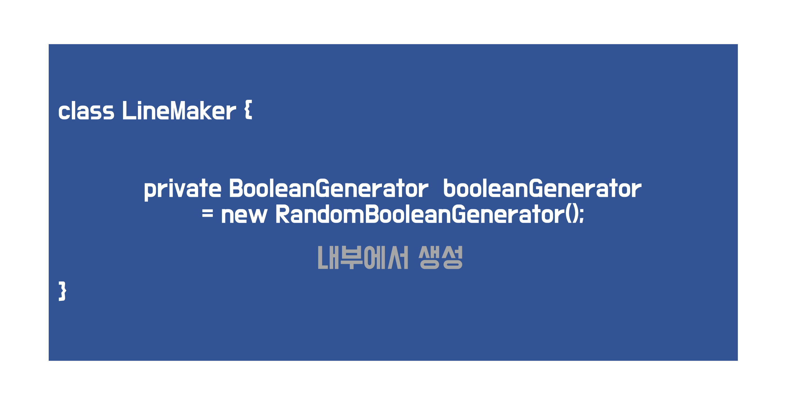
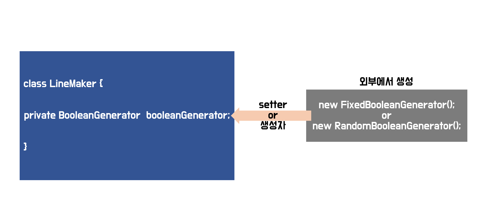

# 아이템 05. 자원을 직접 명시하지 말고 의존 객체 주입을 사용하라
---

# DI(의존성 주입, Dependency Injection)

* 여러 클래스들이 서로 긴밀한 관계를 맺으며 기능을 수행한다.


### 의존 관계(Dependency)


> A가 B에 의존한다

* B의 상태가 바뀔 때 A의 영향을 미치는 것을 `의존 관계`라고 한다.

```java
public class LineMaker {

    private final RandomBooleanGenerator randomBooleanGenerator = new RandomBooleanGenerator();

    // ...

}
```

```java
public class LineMaker {

    private final RandomBooleanGenerator randomBooleanGenerator;

    public LineMaker() {
        this.randomBooleanGenerator = new RandomBooleanGenerator();
    }

    // ...

}
```
* `LineMaker`란 사다리에서 한층을 나타내는 `Line`을 만들어내는 기능을 한다.

* `LineMaker`가 `RandomBooleanGenerator`에 의존하고 있는 상태이다.

### 싱글턴, 정적 유틸리티 클래스


* 정적 유틸리티 클래스
```java
public class LineMaker {

    private static final BooleanGenerator booleanGenerator = new RandomGenerator();

    private LineMaker() {}

    public static List<Line> createLines(int count, int height) {
        List<Line> lines = new ArrayList<>();
        // ...
        return lines;
    }

}
```
* 싱글턴
```java
public class LineMaker {

    private static LineMaker instance;
    private static final BooleanGenerator booleanGenerator;


    private LineMaker() {
        booleanGenerator = new RandomGenerator();
    }

    public static getInstance() {
        if (instance == null) {
            instance = new LineMaker();
        }
        return instance;
    }

    public List<Line> createLines(int count, int height) {
        List<Line> lines = new ArrayList<>();
        // ...
        return lines;
    }

}
```
* 상황에 따라 다른 BooleanGenerator로 교체 해줘야하는 경우 대응하기가 매우 어려워서 적합하지 않다.

* `final`을 제거하고 setter로 필드를 주입하는 방식 또한 좋은 방법은 아니다.


### 강한 결합
* 객체 내에서 직접 의존하는 객체를 생성함

* 만약 위와 같은 상황에서 `RandomBooleanGenerator`를 `FixedBooleanGenerator`로 변경해야하는 상황을 고려해보자.

```java
public class LineMaker {

    //private final RandomBooleanGenerator randomBooleanGenerator;
    private final FixedBooleanGenerator fixedBooleanGenerator;

    public LineMaker() {
        //this.randomBooleanGenerator = new RandomBooleanGenerator();
        this.fixedBooleanGenerator = new FixedBooleanGenerator();
    }

    // ...

}
```
* 변경에 대응하기가 어려움

* 먼저 인터페이스 추상화를 통해서 `BooleanGenerator`를 구현하도록 하는 것이 첫번째일 것이다.

```java
public interface BooleanGenerator {

    boolean generate();

}

public class RandomBooleanGenerator implements BooleanGenerator {

    @Override
    public boolean generate() {
        //...
    }

}

public class FixedBooleanGenerator implements BooleanGenerator {

    @Override
    public boolean generate() {
        //...
    }

}
```

* `DIP 원칙`에 어긋난다.

> **DIP(Dependency Inversion Principle) 원칙**
> 구체화(클래스)에 의존하지 않고, 추상화(추상 클래스 or 인터페이스)에 의존해야한다.

```java
public class LineMaker {

    private final BooleanGenerator booleanGenerator;

    public LineMaker() {
        this.booleanGenerator = new FixedBooleanGenerator();
    }

    // ...

}
```
* `RandomBooleanGenerator`와 `FixedBooleanGenerator`를 `BooleanGenerator`로 추상화한다 하여도 이 객체 생성해주는 부분을 매번 바꿔줘야하기 때문에 마찬가지다.

* `OCP 원칙`에 어긋난다

> **OCP(Open Closed Principle) 원칙**
> 기능 확장에는 개방적이고, 코드 변경에는 폐쇄적이여야 한다.


> 강한 결합의 경우 BooleanGenerator가 LineMaker에 대해서 정의되기 때문에 BooleanGenerator의 변화가 생기면 LineMaker의 수정이 필요할 수 있다.


### 약한 결합
* 외부에서 객체를 생성하여 주입 받음 (DI)


#### setter주입


```java
public class LineMaker {

    //final 선언이 불가
    private BooleanGenerator booleanGenerator;

    public void setBooleanGenerator(BooleanGenerator booleanGenerator) {
        this.booleanGenerator = booleanGenerator;
    }

    // ...

}
```
* 객체 생성 시점에 주입을 하는 것이 아니기 때문에, final로 선언하지 못하고, 불변을 보장하지 못한다.

#### 생성자 주입

```java
public class LineMaker {

    private final BooleanGenerator booleanGenerator;

    public LineMaker(BooleanGenerator booleanGenerator) {
        this.booleanGenerator = booleanGenerator;
    }

    // ...

}
```
* `LineMaker`객체에서 `booleanGenerator`의 불변을 보장한다.
* `LineMaker`는 사용하는 `BooleanGenerator`에 따라 다른 동작을 할 수 있게 된다.
* RadomBooleanGenerator를 주입한 경우
```java
LineMaker randomLineMaker = new LineMaker(new RandomBooleanGenerator());
List<Line> randomLines = randomLineMaker.createLines(); // 랜덤으로 생성된 다리
```
* FixedBooleanGenerator를 주입한 경우

```java
LineMaker fixedLineMaker = new LineMaker(new FixedBooleanGenerator());
List<Line> fixedLines = fixedLineMaker.createLines(); // 고정된 값으로 생성된 다리
```
* 변화에 유연하게 대응하고, 테스트를 용이하게 한다.

#### `자원 팩터리`를 생성자에 넘겨주는 방식

> **팩터리 ?**
> 특정 타입의 인스턴스를 만드는 클래스

* Supplier<T>
```java
@FunctionalInterface
public interface Supplier<T> {
		/**
     * Gets a result.
     *
     * @return a result
     */
    T get(); // T 타입 객체를 찍어낸다
}
```

```java
Supplier<? extends Car>
```
* 이렇게 되면 T가 Car의 하위 클래스라면
* 즉, Car의 하위 클래스를 생성하는 팩터리라면 다 가능

```java
public static Line create(Supplier<? extends Boolean> booleanGenerator){
    // ...
}
```

```java
public static void main(String[] args) {
    Line line = Line.create(() -> new Random().nextBoolean());
}
```

# 정리
* 클래스가 다른 클래스의 의존을 하고 그 클래스가 여러개일 수 있어 어떤 것이냐에 따라 동작이 달라진다면,
  * 싱글턴이나 정적 유틸리티 클래스로 사용하는 것은 적절하지 않다.
  * 인터페이스를 의존하고, 외부에서 생성한 구현체를 주입받는다.


