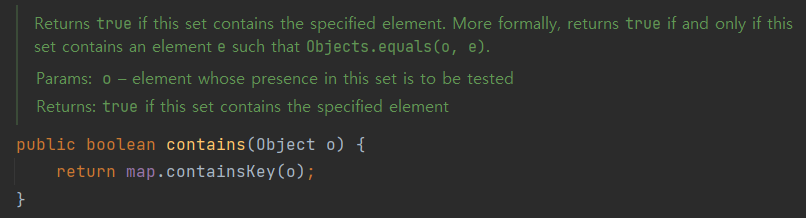

## equals를 재정의하려거든 hashCode도 재정의하라

<br>

**equals를 재정의한 클래스 모두에서 hashCode도 재정의해야 한다.**
그렇지 않으면 hashCode 일반 규약을 어기게 되어 해당 클래스의 인스턴스를 HashMap이나 HashSet 같은 컬렉션의 원소로 사용될 때 문제를 일으킨다.

### 🟦 hashCode 재정의 규약

<p align="center">
<br>
<em>Object의 hashCode 명세</em>
</p>

<br>

> - equals 비교에 사용되는 정보가 변경되지 않았다면, 애플리케이션이 실행되는 동안 그 객체의 hashCode 메서드는 몇 번을 호출해도 일관되게 항상 같은 값을 반환해야 한다. 단, 애플리케이션을 다시 실행한다면 이 값이 달라져도 상관없다.
> - **equals(Object)가 두 객체를 같다고 판단했다면, 두 객체는 hashCode는 똑같은 값을 반환해야 한다.** (특히 중요🤩🤩)
> - equals(Object)가 두 객체를 다르다고 판단했더라도, 두 객체의 hashCode가 서로 다른 값을 반환할 필요는 없다. 단, 다른 객체에 대해서는 다른 값을 반환해야 해시테이블의 성능이 좋아진다.
 
<br>

### 🟥 equals에서 같다고 판단했는데 hashCode가 다르다면?

#### 예시 코드

```java
public class Point {
    private final int x;
    private final int y;

    public Point(final int x, final int y) {
        this.x = x;
        this.y = y;
    }

    @Override
    public boolean equals(Object o) {
        if (this == o) return true;
        if (o == null || getClass() != o.getClass()) {
            return false;
        }
        Point point = (Point) o;
        return x == point.x && y == point.y;
    }
}
```
```java
Set<Point> unitCircle = new HashSet<>();

Point p1 = new Point(1, 0);
Point p2 = new Point(1, 0);
System.out.println(p1.equals(p2)); // true

unitCircle.add(p1);

System.out.println(unitCircle.contains(p1)); // true
System.out.println(unitCircle.contains(p2)); // false
```

- 좌표가 같은 Point는 같은 Point로 보기 위해서 equals를 재정의해주었다.
- `p1.equals(p2) = true`이므로 p1과 p2는 같은 Point라고 기대했지만 `HashSet`의 contains로 확인하니 예상과 다르다.

<br>

<p align="center">
<br>
</p>

<p align="center">
 <br>
</p>

<br>

<p align="center">
<br>
</p>

<br>

**이외에도 다양한 메서드가 논리적 동치성을 확인하기 위해 hashCode를 사용하기 때문에 equals를 재정의하려면 반드시 hashCode도 재정의해주어야 한다.**

<br>

## 좋은 hashCode 작성하기
- 좋지 않은 해시함수는 일반적으로 `O(1)`의 시간 복잡성을 가지는 해시테이블을 `O(n)`까지 만들 수 있다.
- 좋은 해시 함수는 서로 다른 인스턴스들을 주어진 범위에 균일하게 분배해야 한다. 

### 수동으로 좋은 hashCode를 작성하는 요령
> 1. int 변수 result를 선언한 후 값 c로 초기화한다. 이 때 c는 해당 객체의 첫 번째 핵심 필드를 단계 2.a 방식으로 계산한 해시코드다.
> 2. 해당 객체의 나머지 핵심 필드 f 각각에 대해 다음 작업을 수행한다.
>   - a. 해당 필드의 해시코드 c를 계산한다.
>     - 기본 타입 필드라면, Type.hashCode(f)를 수행한다. 여기서 Type은 해당 기본 타입의 박싱 클래스다.
>     - 참조 타입 필드면서 이 클래스의 equals 메서드가 이 필드의 equals를 재귀적으로 호출해 비교한다면, 이 필드의 hashCode를 재귀적으로 호출한다. 계산이 더 복잡해질 것 같으면, 이 필드의 표준형을 만들어 그 표준형의 hashCode를 호출한다. 필드의 값이 null이면 0을 사용한다.(전통적으로 0을 사용한다.)
>     - 필드가 배열이라면, 핵심 원소 각각을 별도 필드처럼 다룬다. 위의 규칙을 재귀적으로 적용해 각 핵심 원소의 해기코드를 계산한 다음 단계 2.b 방식으로 갱신한다. 배열에 핵심 원소가 하나도 없다면 단순히 상수(0을 추천한다)를 사용한다. 모든 원소가 핵심 원소라면 Arrays.hashCode를 사용한다.
>   - b. 단계 2.a에서 계산한 해시코드 c로 result를 갱신한다. 코드로는 다음과 같다. (`result = 31 * result + c`)
> 3. result를 반환한다.

- 파생 필드는 해시코드 계산에서 제외해도 된다.
- equals 비교에 사용되지 않는 필드는 `반드시` 제외해야 한다.

```java
@Override
public int hashCode() {
    int result = Integer.hashCode(x);
    result = 31 * result + Integer.hashCode(y);
    return result;
}
```

<br>

### Objects.hash()
- 이 메서드를 활용하면 위의 요령과 비슷한 수준의 hashCode 함수를 단 한 줄로 작성할 수 있지만, 속도는 좀 더 느리다.
```java
@Override
public int hashCode() {
    return Objects.hash(x, y);
}
```

<br>

### 해시코드 계산하는 비용 줄이기
- 클래스가 불변이고 해시코드를 계산하는 비용이 크다면 캐싱하는 방식을 고려할 수 있다.
- 클래스의 객체가 주로 해시의 키로 사용될 것 같다면 인스턴스가 만들어질 때 해시코드를 계산해둬야 한다. 키로 사용되지 않는다면 hashCode가 처음 불릴 때 계사낳는 지연 초기화(lazy initialization) 전략을 사용해볼 수 있다.

<p align="center">
<br>
<em>String 클래스의 hashCode. hash는 처음에 0으로 초기화되어 있다.</em>
</p>

<br>

## 주의할 점
### 해시코드를 계산할 때 핵심 필드를 생략해서는 안 된다.
- 성능을 빨라질 수는 있지만 해시테이블의 성능을 심각하게 떨어트릴 수 있다.
- 자바 2 이전의 String은 최대 16개의 문자로 해시코드를 계산했는데 URL과 같이 비슷한 문자열을 대량으로 사용할 때 성능이 쉽게 저하될 수 있다.

<br>

### hashCode 생성 규칙을 API 사용자에게 자세히 공표하지 말자
- 추후에 hashCode 생성 규칙이 변경될 수 있으니 사용자가 hashCode의 값에 의지하지 않도록 만들어야 한다.
- 해시 성능을 개선하기 위해 해시코드 생성 규칙은 얼마든지 바뀔 수 있다.