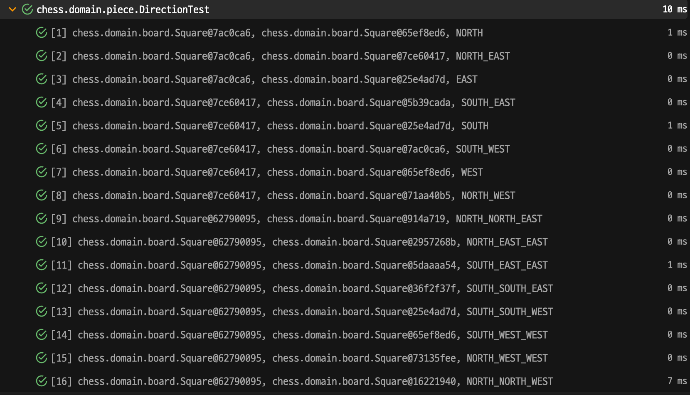

# 아이템 12. toString을 항상 재정의하라

## .toString()

```java
public class Object {
        /**
         * Returns a string representation of the object. In general, the
         * {@code toString} method returns a string that
         * "textually represents" this object. The result should
         * be a concise but informative representation that is easy for a
         * person to read.
         * It is recommended that all subclasses override this method.
         * <p>
         * The {@code toString} method for class {@code Object}
         * returns a string consisting of the name of the class of which the
         * object is an instance, the at-sign character `{@code @}', and
         * the unsigned hexadecimal representation of the hash code of the
         * object. In other words, this method returns a string equal to the
         * value of:
         * <blockquote>
         * <pre>
         * getClass().getName() + '@' + Integer.toHexString(hashCode())
         * </pre></blockquote>
         *
         * @return  a string representation of the object.
         */
        public String toString() {
            return getClass().getName() + "@" + Integer.toHexString(hashCode());
        }
}
```
* toString은 Object의 객체를 문자열로 표현하는 메서드다.
  * `클래스의 이름 + @ + 해시코드의 16진수`를 반환
* 모든 서브 클래스에서 재정의하는 것을 권고한다.

## 재정의를 권고하는 이유
> 그냥 안쓰면 되는 거 아닐까?
```java
System.out.println(obj);
```
* 위의 메서드를 호출한 메서드를 살펴보자.
```java
public class PrintStream extends FilterOutputStream implements Appendable, Closeable {
    // ...
    public void print(Object obj) {
        write(String.valueOf(obj));
    }
    // ...
}
```
* String.valueOf(obj)를 호출하게 되고
```java
public final class String implements java.io.Serializable, Comparable<String>, CharSequence {
    // ...
    public static String valueOf(Object obj) {
        return (obj == null) ? "null" : obj.toString();
    }
    // ...
}
```
* 해당 객체의 toString()메서드가 호출되게 된다.
* toString을 오버라이딩하지 않으면 위의 출력 결과물로 `클래스의 이름 + @ + 해시코드의 16진수`가 나오게 된다.
  * 이렇다면 이 객체가 가진 정보에 대해서는 읽는 사람이 거의 알 수 있는 정보가 없다.
* 이렇게, 개발자가 직접 toString()메서드를 호출하지 않더라도 toString()에 정의해놓은 문자열 정보를 사용하는 경우가 많다.
    * 로깅, 디버깅, 테스트와 같이 문자열로 객체를 표현하는 상황

```java
public class Square {
    private final File file;
    private final Rank rank;
}
```
* `Square`는 `File(행)`과 `Rank(열)`로 체스판의 위치를 나타내는 클래스이다.
* 만약 Square를 재정의 하지 않는다면 다음과 같은 문제점이 나타날 수 있다.
```java
    @ParameterizedTest
    @MethodSource("directionDummy")
    @DisplayName("두 Square에 대한 방향을 구한다.")
    void of(Square sourceSquare, Square targetSquare, Direction expectedDirection) {
        // expected
        assertThat(Direction.of(sourceSquare, targetSquare)).isEqualTo(expectedDirection);
    }
```


* 두 Square에 대하여 Direction을 구하는 기능을 테스트다.
* toString을 재정의 하지 않으면 출력된 테스트가 각각 어떤 Square로 테스트를 하는지 정보전달이 되지 않는다.

> 그렇다면 어떻게 재정의 해야될까?

## 객체가 가진 정보는 모두 담고있어야 한다.
* 체스 말을 나타내는 클래스
```java
public class Piece {
    private final Role role;
    private final Side side;
    private final Square square;
    // ...
    @Override
    public String toString() {
        return "Piece{" +
                "role=" + role +
                '}';
    }
}
```
* 위과 같이 toString을 오버라이딩 한다면
  * `a2`의 위치에 있는 `백`의 `PAWN`과 
  * `a7`의 위치에 있는 `흑`dml `PAWN`은
  * 둘다 `Piece{role=PAWN}`으로 출력될 것이다.

## 읽기 쉬운 정보를 담고 있어야한다.

#### 컬렉션 프레임워크의 toString()
```java
public abstract class AbstractCollection<E> implements Collection<E> {
  // ...
  public String toString() {
    Iterator<E> it = iterator();
    if (!it.hasNext())
      return "[]";

    StringBuilder sb = new StringBuilder();
    sb.append('[');
    for (; ; ) {
      E e = it.next();
      sb.append(e == this ? "(this Collection)" : e);
      if (!it.hasNext())
        return sb.append(']').toString();
      sb.append(',').append(' ');
    }
  }
  // [0번째, 1번째, 2번쨰, ... ]
  // ...
}
```
* ArrayList의 경우 Iterator로 돌아가며 `[요소1, 요소2, ...]` 모든 요소를 반환한다.
```java
public abstract class AbstractMap<K,V> implements Map<K,V> {
    // ...
    public String toString() {
        Iterator<Entry<K,V>> i = entrySet().iterator();
        if (! i.hasNext())
            return "{}";
  
        StringBuilder sb = new StringBuilder();
        sb.append('{');
        for (;;) {
            Entry<K,V> e = i.next();
            K key = e.getKey();
            V value = e.getValue();
            sb.append(key   == this ? "(this Map)" : key);
            sb.append('=');
            sb.append(value == this ? "(this Map)" : value);
            if (! i.hasNext())
              return sb.append('}').toString();
            sb.append(',').append(' ');
        }
    }
    // {키1=밸류1, 키2=밸류2, ...}
    // ...
}
```
* HashMap의 경우 entrySet()에서 반환된 Set<Entry<K,V>>를 Iterator로 돌아가며 `{키1:밸류1, 키2, 밸류2, ...}`를 반환한다.

#### 인텔리 제이가 자동으로 생성해주는 toString
```java
public class Piece {
    private final Role role;
    private final Color color;
    // ...
    @Override
    public String toString() {
        return "Piece{" +
                "role=" + role + 
                ", color=" + color + 
                '}';
    }
}
```
* 클래스 명
* 객체의 이름
* (필요에 의해서) 해시코드 등

#### 표현할 정보가 너무 많은 경우
```java
public class Board {
    private final Map<Square, MovablePiece> board;
    private Side turn;
}
```
* 체스판 같은 경우, 현재 말이 있는 Square와 그 위치에 있는 말 객체를 담고있는 Map을 필드로 한다.
* board를 그대로 반환하게 되면 Map의 toString()에 의해서 모든 `스퀘어=말`이 모두 반환된다.
* 이는 알아보기 매우 어렵고, 유용한 정보도 아니다.

```java
    @Override
    public String toString() {
        return "Board{" +
                "board의 Piece 개수=" + board.size() +
                ", turn=" + turn +
                '}';
    }
```
* 위와 같이 현재 체스판에 말이 몇개 있는지, 누구의 턴인지 정도만 나타내면 대략적으로 객체의 상태를 알 수 있을 것이다.

## toString의 반환값을 문서화할지 결정
#### 포맷을 적용하지 않으면
```java
public class Square {
    private final File file;
    private final Rank rank;
    
    @Override
    public String toString() {
        return "Square{" +
                "file=" + file +
                ", rank=" + rank +
                '}';
    }
}
```
* 추후에 정보에 추가를 하는데 용이하다.
* 포맷에 얽매이지 않는다.

#### 포맷을 적용하면
```java
public class Square {
    private final File file;
    private final Rank rank;

  /**
   * Square의 문자열을 반환한다.
   * 이 문자열은 "a2" 형태로 2글자로 구성된다.
   * a는 소문자 알파벳으로 file을 나타낸다.
   * 2는 10진수 숫자로 rank를 나타낸다.
   */
  @Override
    public String toString() {
        return String.format("%s%s", file, rank);
    }
}
```

* 값을 나타내는 클래스라면 포맷을 문서화하길 권한다.
* 사람이 읽을 수 있게 된다.
* 단점
  * 추후에 정보를 추가하는데 어려움이 있다.
  * 포맷에 얽매인다.

#### 포맷에 대응하는 정적 팩토리 메서드
* toString이 포맷을 문서화했다면, 그에 대응하는 정적 팩터리나 생성자를 제공할 수 있다.
```java
public class Square {
    private static final Map<File, Map<Rank, Square>> CACHE;

    private final File file;
    private final Rank rank;
    
    public static Square of(String input) {
        int fileValue = input.charAt(0) - 'a' + 1;
        int rankValue = input.charAt(1) - '1' + 1;
        File file = File.from(fileValue);
        Rank rank = Rank.from(rankValue);
        Map<Rank, Square> rankSquareMap = CACHE.get(file);
        return rankSquareMap.get(rank);
    }
      
    @Override
    public String toString() {
      return String.format("%s%s", file, rank);
    }
}
```
* toString의 반환 형태인 `"a2"`인 값을 매개변수로 받아서 객체를 반환하는 정적 메서드 또한 만들 수 있다.

## toString을 재정의하지 않아도 되는 경우
1. 정적 유틸리티 클래스
   - 객체를 만들어서 사용하지 않기 떄문에, 표현할 상태가 없다.
2. enum
    - 이미 알기 쉬운 정보로 잘 처리되어있음
```java
public abstract class Enum<E extends Enum<E>> implements Comparable<E>, Serializable {
    private final String name;
    // ...
    protected Enum(String name, int ordinal) {
        this.name = name;
        this.ordinal = ordinal;
    }
    // ...
    public String toString() {
        return name;
    }
}
```

## toString을 재정의할 때 주의
#### 의존을 양방향으로 하고 있으면 무한 호출에 빠질 수 있다.
* 체스 말이 칸을 가지고 있는 경우
```java
public class Piece {
    private final Role role;
    private final Color color;
    private final Square square;
    // ...
    @Override
    public String toString() {
        return "Piece{" +
                "role=" + role +
                ", color=" + color +
                ", square=" + square +
                '}';
    }
}
```
* 칸이 체스 말을 가지고 있는 경우
```java
public class Square {
    private final File file;
    private final Rank rank;
    private final Piece piece;
    
    @Override
    public String toString() {
        return "Square{" +
                "file=" + file +
                ", rank=" + rank +
                ", piece=" + piece +
                '}';
    }
}
```
* 이렇게 `Piece` &harr; `Square`을 서로를 toString에서 부르게 되면,
* 계속해서 서로의 toString()을 무한으로 호출하게 된다.
* 이럴 경우, String 리터럴로 명시하는 것을 추천한다.

## 정리
* 특별한 경우를 제외하고 toString을 모두 재정의하자.
* 모든 정보를 담고 있어야 한다.
* 읽기 쉬운 정보여야한다.
* IDE나 Lombok에서 제공하는 toString도 좋은 방법이다.
