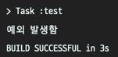
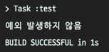
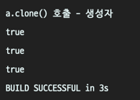
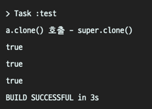
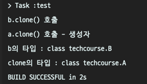
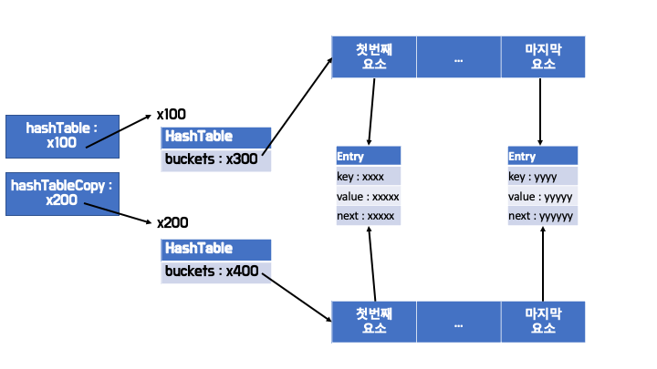

# 아이템 13. clone 재정의는 주의해서 진행하라

# 얕은 복사 vs 깊은 복사
```java
public class Person {
    String name;
    int age;
    
    Person (String name, int age) {
        this.name = name;
        this.age = age;
    }
}
```

### 얕은 복사


* 참조 주소 값을 복사


### 깊은 복사


* 실제 값을 메모리 상에 복사


# Cloneable 인터페이스

```java
/**
 * A class implements the Cloneable interface to indicate to the Object.clone() method that it is legal for that method to make a field-for-field copy of instances of that class.
 Invoking Object's clone method on an instance that does not implement the Cloneable interface results in the exception CloneNotSupportedException being thrown.
 By convention, classes that implement this interface should override Object.clone (which is protected) with a public method. See Object.clone() for details on overriding this method.
 Note that this interface does not contain the clone method. Therefore, it is not possible to clone an object merely by virtue of the fact that it implements this interface. Even if the clone method is invoked reflectively, there is no guarantee that it will succeed.
 */
public interface Cloneable {
}
```

* 믹스인 인터페이스
* 아무 내용도 없는 인터페이스
* 해당 인터페이스를 구현했다는 것은 복제가 가능하다는 것을 의미한다.

# clone()
```java
public class Object {
    // ...
    @HotSpotIntrinsicCandidate
    protected native Object clone() throws CloneNotSupportedException;
    // ...
}
```

> clone 메서드는 객체를 복제하여 새로운 객체를 반환하는 메서드
- protected
  - 같은 패키지나 `자식 클래스`에서 사용할 수 있는 접근 제어자
- native
  - JNI(Java Native Interface)를 사용하여 실행하는 메서드
- 동작
  1. `Cloneable`을 구현했는지 확인 &rarr; 안되었으면 `CloneNotSupportedException` 발생
  2. 객체를 복제한 새 객체를 반환(구현은 JVM마다 다를 수 있다)
- 규약
  1. x.clone() != x : 새로운 객체여야 한다.
  2. x.clone().getClass() == x.getClass() : 같은 타입(클래스)여야 한다.
  3. x.clone().equals(x) : 필드가 모두 같아야 한다.


```java
    @Test
    public void test() {
        ChessPiece chessPiece = new ChessPiece();
        try {
            chessPiece.clone();
            System.out.println("예외 발생하지 않음");
        } catch (CloneNotSupportedException e) {
            System.out.println("예외 발생함");
        }
    }
```

* Cloneable을 구현하지 않음

```java
public class ChessPiece {
    // ...
    @Override
    public Object clone() throws CloneNotSupportedException {
        return super.clone();
    }
    // ...
}
```



* Cloneable을 구현

```java
public class ChessPiece implements Cloneable {
    // ...
    @Override
    public Object clone() throws CloneNotSupportedException {
        return super.clone();
    }
    // ...
}
```



# clone()을 재정의하는 방법
* 클래스에 Cloneable 인터페이스를 구현하거나,
* clone() 을 완벽히 재정의한 클래스를 상속해야 한다.

### clone() 구현 시, new 연산자 사용 X


```java
class A implements Cloneable {
    private final int value;
    private final String text;

    public A(int value, String text) {
        this.value = value;
        this.text = text;
    }

    @Override
    public boolean equals(Object o) {
        if (this == o) return true;
        if (o == null || getClass() != o.getClass()) return false;
        A a = (A) o;
        return value == a.value && Objects.equals(text, a.text);
    }

    @Override
    public int hashCode() {
        return Objects.hash(value, text);
    }
}
```

* 위와 같은 클래스에서 clone()을 재정의 할 때, 복제된 객체인지 확인하자

```java
    @Test
    public void test() {
        try {
            A a = new A(1, "일");
            A clone = (A) a.clone();

            System.out.println(a != clone);
            System.out.println(a.getClass() == clone.getClass());
            System.out.println(a.equals(clone));

        } catch (CloneNotSupportedException e) {
            System.out.println("예외 발생함");
        }
    }
```

* 생정자로 새로운 객체를 반환하는 것
```java
    @Override
    public Object clone() throws CloneNotSupportedException {
        System.out.println("a.clone() 호출");
        return new A(this.value, this.text);
    }
```




* `super.clone()`으로 새로운 객체를 복제하여 반환하는 것

```java
    @Override
    public Object clone() throws CloneNotSupportedException {
        System.out.println("a.clone() 호출");
        return super.clone();
    }
```



* A의 입장에서는 두 경우가 별반 차이가 없다.

* 만약, A를 상속한 B가 존재한다면

```java
class B extends A {
    public B(int value, String text) {
        super(value, text);
    }

    @Override
    protected Object clone() throws CloneNotSupportedException {
        System.out.println("b.clone() 호출");
        return super.clone();
    }
}
```
* A가 clone()에서 생성자를 사용했다면,
```java
    @Test
    public void test() {
        try {
            B b = new B(1, "일");
            Object clone = b.clone();

            System.out.println("b의 타입 : " + b.getClass());
            System.out.println("clone의 타입 : " + clone.getClass());
        } catch (CloneNotSupportedException e) {
            System.out.println("예외 발생함");
        }
    }
```

* A의 clone()에서 A타입의 객체를 반환하므로 둘의 타입이 달라진다.

### 불변 객체
* 객체의 필드가 모두 불변의 경우
```java
public class ChessPiece implements Cloneable {
    
    private final Role role; //enum
    private final Color color; //enum
    
    @Override
    public ChessPiece clone() throws CloneNotSupportedException {
        return (ChessPiece) super.clone();
    }
    // ...
}
```
* 공변 반환 타입 (jdk 1.5 ~)
  * 부모 클래스의 반환 타입(Object)을
  * 자식 클래스의 타입(ChessPiece)으로 변경한다.
* clone() 을 완벽히 재정의한 클래스를 상속했다면,
  * 형변환에서 절대 실패하지 않을 것이다.

> 불변 객체를 복제할 필요가 있을까?

### 가변 객체
```java
public class Board implements Cloneable{
    private final Map<Square, Piece> board;
    private Side turn;
    
    // ...
    
    @Override
    public Board clone() throws CloneNotSupportedException {
        return (Board) super.clone();
    }
}
```
* 이렇게 clone()을 재정의 하게 되면
* `Board board`와 `board.clone()` 은 다른 객체지만, `필드의 참조주소는 같다.`
  * `board.clone()`의 상태의 변화가
  * `board`의 상태를 변화하게 된다.

### 원본 객체를 안전하게 유지
```java
    @Override
    public Board clone() throws CloneNotSupportedException {
        Board result = (Board) super.clone();
        result.board = board.clone();
        result.side = side.clone();
        return result;
    }
```
* 필드도 각각 복제한 객체로 할당해주어야 한다.
* 하지만, 몇 가지 문제점이 있다.
  1. Side는 clone()을 재정의하지 않았다.
  2. board 필드는 final 이다. 
* 무엇이 되었든, clone()을 사용하기 위해, 필드의 final을 제거하는 것은 과하다.
* 이것만으로 충분하지 않을 수도 있다. (책 예제)

```java
public class HashTable implements Cloneable {
    private Entry[] buckets = new Entry[10];

    private static class Entry {
        final Object key;
        Object value;
        Entry next;

        Entry(Object key, Object value, Entry next) {
            this.key = kye;
            this.value = value;
            this.next = next;
        }
    }
    
    @Override
    public HashTable clone() {
        try {
            HashTable result = (HashTable) super.clone();
            result.buckets = buckets.clone();
            return result;
        } catch (CloneNotSupportedException e) {
            // ...
        }
    }
}
```

* 각 배열(Entry[] buckets)은 따로 존재하지만,
* 요소(Entry)는 같은 주소를 참조한다.
* 복제본의 상태의 변경이 원본에 해를 끼칠 수 있는 상황이다.

```java
public class HashTable implements Cloneable {
    private Entry[] buckets = new Entry[10];

    private static class Entry {
        final Object key;
        Object value;
        Entry next;

        Entry(Object key, Object value, Entry next) {
            this.key = kye;
            this.value = value;
            this.next = next;
        }
        
        Entry deepCopy() {
            //return new Entry(key, value, next == null ? null : next.deepCopy());
            Entry result = new Entry (key, value, next);
            for (Entry p = result; p.next != null; p = p.next) {
                p.next = new Entry(p.next.key, p.next.value, p.next.next);
            }
        }
    }

    @Override
    public HashTable clone() {
        try {
            HashTable result = (HashTable) super.clone();
            result.buckets = new Entry[buckets.length];
            for (int i = 0; i < buckets.length; i++) {
                result.buckets[i] = this.buckets[i] == null ?
                                null : this.buckets[i].deepCopy();
            }
            return result;
        } catch (CloneNotSupportedException e) {
            // ...
        }
    }
}
```

### 고수준의 메서드를 활용한다.
```java
    @Override
    public HashTable clone() {
        try {
            HashTable result = (HashTable) super.clone();
            result.buckets = new Entry[buckets.length];
            for (int i = 0; i < buckets.length; i++) {
                result.put(key, value);
            }
            return result;
        } catch (CloneNotSupportedException e) {
            // ...
        }
    }
```
### 그 외
1. 재정의될 가능성이 있는 메서드는 호출하지 않아야한다.
   1. 만약 위에서 put이 재정의 되었다면,
   2. 하위 클래스에서는 put으로 교정할 기회를 잃어버린다. 

2. throws 절을 없앤다.

3. clone() 퇴화 
   1. final로 막고
   2. 예외 발생

# 복사 생성자와 복사 팩터리 메서드 사용
* clone()을 재정의하는 위험한 행동을 하지 않아도, 생성자와 팩터리 메서드를 통해 충분히 객체를 안전하게 복사할 수 있따.
* final과 충돌하지도 않고,
* 불필요한 체크드 예외도 신경쓰지 않아도 되고,
* 형변환도 필요하지 않음

```java
public ChessPiece(ChessPiece chesspiece) {
    // ...    
}
```

```java
public static ChessPiece copyOf(ChessPiece chesspiece) {
    // ..
    return ...;      
}
```

