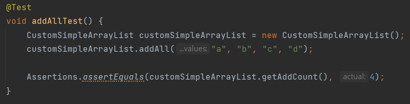
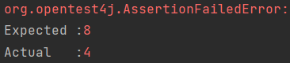
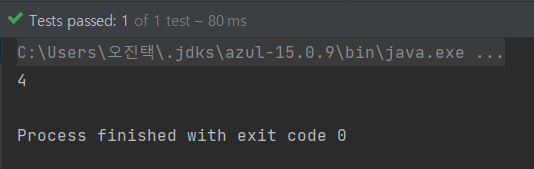
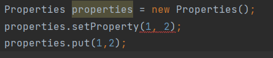

# 상속보다는 컴포지션을 사용하라

## 상속은 왜 사용하는 거지?
- 이미 만들어져 있는 클래스를 재사용할 수 있기 때문에 효율적이고 중복된 코드가 줄어들어 코드가 간결해진다.
- 공통적인 기능을 부모 클래스에 추가해주면 상속받은 여러 개의 자식 클래스에서 사용이 가능하기 때문에 확장성 또한 용이하다.

<br>

## 상속의 종류
### 구현 상속 (클래스 상속)

<details>
<summary>예시 코드</summary>

```java
public class SimpleList {
    
    String[] simpleList;
    int size;
    
    SimpleList() {
        simpleList = new String[10];
        size = 0;
    }

    void add(String value) {
        simpleArrayList[size] = value;
        size += 1;
    }
}
```
```java
public class SimpleArrayList extends SimpleList {
    
    @Override
    void add(String value) {
        if (size == simpleArrayList.length) {
            makeListSizeDouble();
        }
        simpleArrayList[size] = value;
        size += 1;
    }
    //SimpleArrayList까지 상속한 클래스는 SimpleListArrayList.add()를, SimpleList까지 상속한 자식 클래스는 SimpleList.add()를 호출한다.

    private void makeListSizeDouble() {
        String[] simpleArrayList = new String[size * 2];
        for (int index = 0; index < size; index++) {
            simpleArrayList[index] = this.simpleArrayList[index];
        }
        this.simpleArrayList = simpleArrayList;
    }
}
```
</details>

   - 상속받고자 하는 자식 클래스 이름 앞에 **extends** 키워드를 붙이고 상속할 부모 클래스 이름을 붙인다.
   - 자식 클래스는 따로 필드를 생성하지 않아도 상속받은 부모 클래스의 **접근 가능한 필드**를 가져와서 사용할 수 있다.
   - 자식 클래스는 부모 클래스의 메소드를 오버라이딩을 통해 재정의하여 사용할 수 있다.

### 인터페이스 상속

<details>
<summary>예시 코드</summary>

```java
public interface SimpleList {
    void add(String value);
}
```
```java
public class SimpleArrayList implements SimpleList {
    
    private String[] simpleList;
    private int size;
    
    public SimpleArrayList() {
        simpleList = new String[10];
        size = 0;
    }
    
    @Override
    void add(String value) {
        simpleArrayList[size] = value;
        size += 1;
    }
}
```
</details>

- 인터페이스는 **implements** 키워드를 통해 상속받을 수 있다.
- 인터페이스를 상속받은 자식 클래스는 상속받은 **인터페이스의 메소드를 반드시 오버라이딩**해야 한다.

<br>

## 왜 상속을 사용할 때 신중해야 하는지?
문제가 되는 것은 '인터페이스 상속'이 아니라 '구현 상속'이다.<br>
구현 상속은 메서드 호출과 달리 **캡슐화를 깨트린다**. 상위 클래스가 어떻게 구현되느냐에 따라 하위 클래스의 동작에 이상이 생길 수 있다. <br>

<details>
<summary>예시 코드</summary>

```java
public class SimpleList {
    
    String[] simpleList;
    int size;
    
    SimpleList() {
        simpleList = new String[10];
        size = 0;
    }

    void add(String value) {
        simpleArrayList[size] = value;
        size += 1;
    }
    
    void addAll(String ... values) {
        for (String value : values) {
            add(value);
        }
    }
}
```

```java
public class SimpleArrayList extends SimpleList {

    @Override
    void add(String value) {
        if (size == simpleArrayList.length) {
            makeListSizeDouble();
        }
        simpleArrayList[size] = value;
        size += 1;
    }

    private void makeListSizeDouble() {
        String[] simpleArrayList = new String[size * 2];
        for (int index = 0; index < size; index++) {
            simpleArrayList[index] = this.simpleArrayList[index];
        }
        this.simpleArrayList = simpleArrayList;
    }
}
```

```java
public class CustomSimpleArrayList extends SimpleArrayList {
    
    private int addCount;

    CustomSimpleArrayList() {
        addCount = 0;
    }

    @Override
    boolean add(String value) {
        addCount++;
        return super.add(value);
    }

    @Override
    void addAll(String ... values) {
        addCount += values.length;
        super.addAll(values); //내부적으로는 CustomSimpleArrayList.add가 values의 length만큼 실행된다.
    }

    public int getAddCount() {
        return addCount;
    }
}
```

```java
public class Main {
    public static void main(String[] args) {
        
        CustomSimpleArrayList customSimpleArrayList = new CustomSimpleArrayList();
        customSimpleArrayList.addAll("a", "b", "c", "d");

        System.out.println(customSimpleArrayList.getAddCount());
    }
}
```
<p align="center">
<br>
<em>4개 요소를 추가했으니 addCount는 4가 나오겠지?</em>
</p>

<br>

<p align="center">
<br>
<em>아니다.</em>
</p>
</details>

<br>

## 어떻게 문제를 해결할 수 있을까?
### 1. addAll 메서드를 재정의하지 않는다.
- `SimpleArray`의 내부 구현이 어떻게 되어 있는지 알고 있을 때 사용할 수 있는 방법
- 상위 클래스의 구현 방식이 변경된다면 유효한 방법일지 보장할 수 없다.
### 2. addAll 메서드를 상위 클래스와는 상관이 없도록 재정의한다.
- `super.addAll(values)`을 호출하지 않고 내부적으로 values를 순회하면서 `add(value)`를 호출하도록 재정의한다.
- 상속할 때마다 메서드들을 전부 재정의해주면 되겠지만 상속을 사용하는 의미가 없어진다.
- 상위 클래스의 private 필드에 접근하지 못해서 재정의하지 못하는 경우도 발생할 수 있다.
### 3. 기존 메서드를 재정의하는 대신 상속 후 새로운 메서드를 추가한다.
<details>
<summary>예시 코드</summary>

```java
public void countAdd(String value) {
    addCount++;
    add(value);
}

public void countAddAll(String ... values) {
    addCount += values.length;
    addAll(values);
}
```
</details>

- 훨씬 안전한 방법은 맞지만 위험요소가 없는 건 아니다.
- 하위 클래스에 추가한 메서드와 시그니처가 같고 반환 타입은 다른 메서드가 추가될 수도 있다.

<br>

## Composition(조합)을 사용하자
- 기존 클래스를 확장하는 대신, 새로운 클래스를 만들고 **private 필드로 기존 클래스의 인스턴스를 참조**하게 한다.
- 그 후 새 클래스의 인스턴스 메서드들은 기존 클래스의 대응하는 메서드를 호출해 그 결과를 반환한다.
- 이 방식을 **전달(forwarding)** 이라고 하며, 새 클래스의 메서드들을 전달 메서드라고 한다.
- 쉽게 말해 **컴포지션**은 기존 새로운 클래스 내에 기존 클래스의 인스턴스를 참조하는 것, **전달**은 새 클래스의 메서드들이 기존 클래스의 대응하는 메서드들을 호출하는 것이다.

<details>
<summary>예시 코드</summary>

```java
public class ForwardingSimpleArrayList extends SimpleArrayList{

    private SimpleArrayList simpleArrayList;

    public ForwardingSimpleArrayList(SimpleArrayList simpleArrayList) {
        this.simpleArrayList = simpleArrayList;
    }

    @Override
    public void add(String value) {
        simpleArrayList.add(value);
    }

    @Override
    public void addAll(String ... values) {
        simpleArrayList.addAll(values);
    }
}
```

```java
public class CustomSimpleArrayList extends ForwardingSimpleArrayList {
    private int addCount;

    public CustomSimpleArrayList(SimpleArrayList simpleArrayList) {
        super(simpleArrayList);
        addCount = 0;
    }

    @Override
    public void add(String value) {
        addCount++;
        super.add(value); //simpleArrayList.add(value)가 실행된다.
    }

    @Override
    public void addAll(String ... values) {
        addCount += values.length;
        super.addAll(values); //simpleArrayList.addAll(values)가 실행된다.
    }

    public int getAddCount() {
        return addCount;
    }
}
```
<p align="center">
 <br>
<em>요소를 실제 추가한만큼 addCount가 증가했다.</em>
</p>
</details>

<br>

위의 예시는 임의의 `SimpleArrayList`에 `몇 개의 원소가 추가되었는지 판단하는 기능`을 덧씌워 새로운 `CustomSimpleArrayList` 클래스를 만드는 것이다.<br>
이 때 새로운 클래스는 기존 클래스의 내부 구현 방식의 영향에서 벗어날 수 있고, 기존 클래스에 새로운 메서드가 추가되더라도 전혀 영향받지 않는다.

<br>

## 래퍼 클래스(Wrapper Class)
- 위의 `CustomSimpleArrayList`와 같은 클래스를 다른 인스턴스를 감싸고 있다는 뜻에서 래퍼 클래스라 부른다. (ex. Integer)
- 추가적인 기능을 덧씌운다는 뜻에서 **데코레이터 패턴**이라고 부르기도 한다.

### 래퍼 클래스의 단점
- 래퍼 클래스는 콜백(callback) 프레임워크와는 어울리지 않는다.
- 내부 객체는 자신을 감싸고 있는 래퍼의 존재를 모르니 자신의 참조(this)를 넘기고, 콜백 때는 래퍼가 아닌 내부 객체를 호출하게 된다.
- 참고 링크 : https://stackoverflow.com/questions/28254116/wrapper-classes-are-not-suited-for-callback-frameworks

<br>

## 위임
- 컴포지션과 전달의 조합은 넓은 의미로 **위임(Delegation)** 이라고 부른다. (단, 래퍼 객체가 내부 객체에 자기 자신의 참조를 넘기는 경우에만 위임에 해당한다.)
- **has-a 관계**로 표현할 수 있다. 다른 클래스를 멤버로 포함하는 형태로 정의하는 방법이다.

<br>

## 상속을 사용하기 위해서 무엇을 고려해야 할까?
- 상속은 반드시 하위 클래스가 상위 클래스의 **진짜** 하위 타입인 상황에서만 쓰여야 한다.
- 쉽게 **'is-a 관계'** 일 때 사용하면 된다.
- 클래스 A가 B의 필수 구성요소가 아니라 구현하는 방법 중 하나라면 Composition을 활용한다.
- 잘못된 상속은 노출된 내부에 직접 접근할 수 있어 위험하다. (ex. `Properties`)

<br>

<p align="center">
<br>
<em>Properties.setProperty는 key와 value 모두 String만 허용한다.</em>
</p>

<br>

<p align="center">
<br>
<em>Properties Javadoc</em>
</p>
