<br>
<br>

해당 챕터를 이해하기 위해서는 우선 변성(Variance)에 대한 이해가 필요합니다.

<br>
<br>

## 🧐 변성에 대하여

변성의 종류에는 **공변성**(Covariance)과, **반공변성**(Contravariance), **무공변성**(Invariance)이 있습니다.

이들을 타입 시스템에서 매우 중요한 개념으로, 간단하게 정리하면 아래와 같습니다.

<br>
<br>

### 📕 공변성(Covariance)

공변성은 부모 클래스의 타입을 자식 클래스의 타입으로 대체할 수 있는 성질을 의미합니다.

> **S**가 **T**의 하위 타입일 때, I<**S**\> 역시 I<**T**\>의 하위 타입인 경우 이를 **공변성**을 가진다고 합니다.

공변의 예시로는 자바에서의 **배열**과, **메서드 반환 타입**이 있는데요, 이들을 각각 살펴보도록 하겠습니다.


배열은 공변이므로, 위와 같은 코드가 오류가 발생하지 않고 잘 실행되는 것을 알 수 있습니다.

또한 자바에서의 메서드 반환 타입 역시 공변인데요,

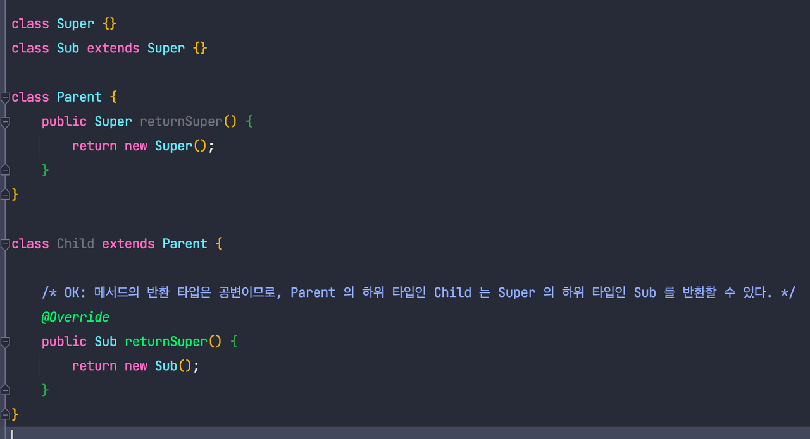

따라서 위와같은 코드가 가능합니다.

<br>
<br>

### 📗 반공변성(Contravariance)

반공변성은 공변성과 반대로, 자식 클래스의 타입을 부모 클래스의 타입으로 대체할 수 있는 성질을 의미합니다.

> **S**가**T**의 하위 타입일 때, I<**T**\>가 I<**S**\>의 하위 타입인 경우 이를 **반공변성**을 가진다고 합니다.

자바에서 반공변의 예시는 제가 알기로는 하나밖에 없는데, 이는 아래에서 살펴볼 내용이므로 이곳에서는 넘어가도록 하겠습니다.

<br>
<br>

### 📘 무공변성(Invariance)

무공변성은 부모 타입과 자식 타입간의 변환을 제한하는 성질을 의미합니다.

> **S**가**T**의 하위 타입일 때, I<**S**\> 가 I<**T**\>의 상위 타입도, 하위 타입도 아닌 경우 이를 **무공변성**을 가진다고 합니다.

자바에서 무공변성의 예시로는 **메서드 인자** **타입**이 있는데요, 다음과 같습니다.

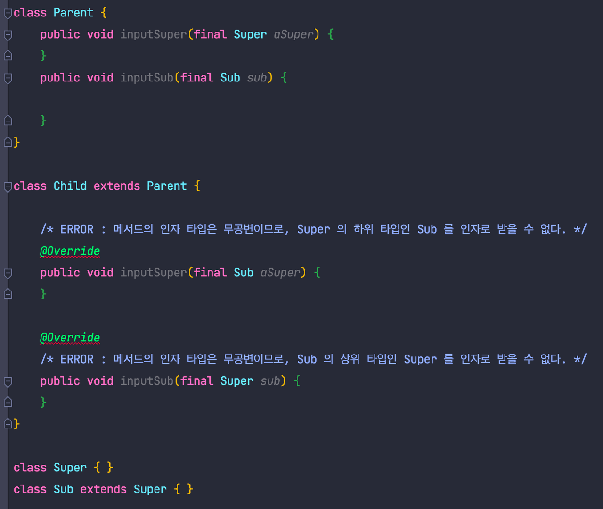

이렇게 간단하게 변성의 종류에 대해 알아보았습니다.

<br>
<br>
<br>
<br>

## 🧐 제네릭의 변성

매개변수화된 타입(Parameterized type)은 **무공변**(invariant)입니다.

즉 다음과 같은 코드가 성립되지 않는다는 의미입니다.

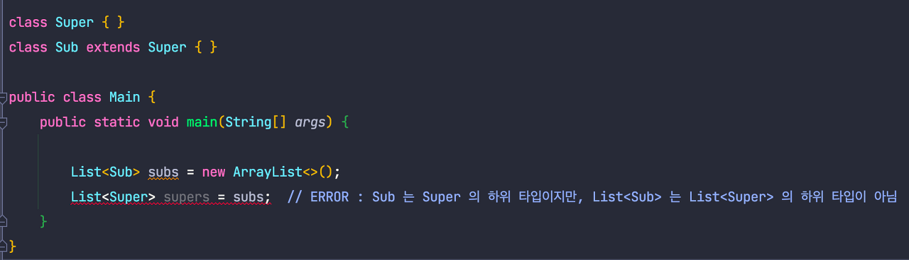

이는 직관적이지는 않지만, 만약 제네릭이 공변성을 가진다면 다음과 같은 코드가 가능해 질 것입니다.

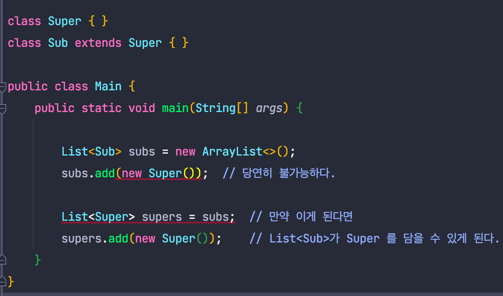

이를 방지하기 위해 제네릭을 무변성으로 설계한 것이 아닐까 생각합니다.

<br>
<br>

### 🙋‍♂️ 배열은 공변인걸요?

맞습니다. 배열은 공변입니다.

즉 위의 예시 코드에서 List를 배열로 바꾸어 코드를 작성하면 컴파일에 성공하게 됩니다.

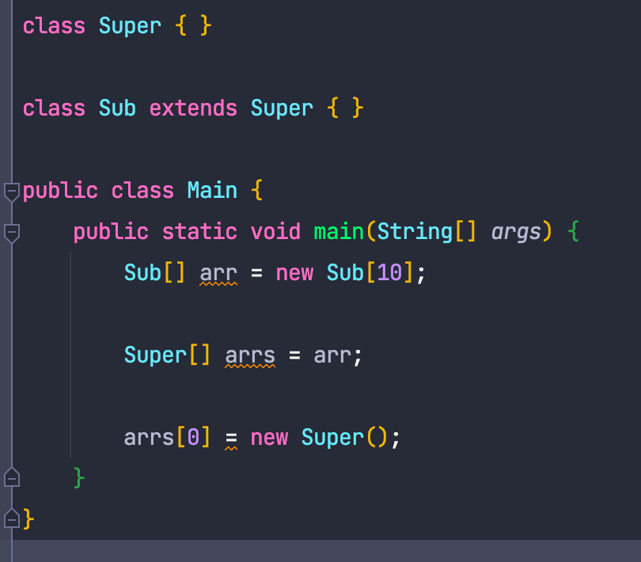

보시는 것과 같이, 컴파일은 문제없이 된다는 것을 알 수 있습니다.

그럼 공변이 좋은거 아닌가요?? 할 수 있지만, 이를 실행시켜보면 다음과 같이 예외가 발생하게 됩니다.

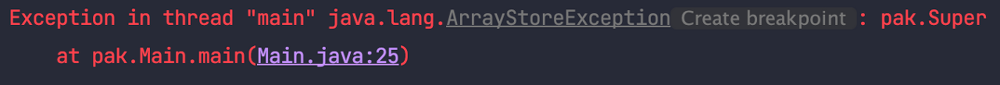

따라서 공변성을 가지도록 설계된 배열은 안전하지 않다는 것을 알 수 있습니다.

그럼 무변성은 항상 좋을까요?

<br>
<br>
<br>
<br>

## 🧐 무공변일 때의 문제

아래와 같은 예시를 생각해 보도록 하겠습니다.

```java
public class Food {
}

// 김치
public class Kimchi extends Food {
}

// 라면
public class Ramen extends Food {
}

// 냉장고
public class Refrigerator {

    private final List<Food> foods = new ArrayList<>();

    public void putFoods(final List<Food> foods) {
        this.foods.addAll(foods);
    }
}
```

이후 냉장고에 라면을 넣는 코드를 작성해 보도록 하겠습니다.

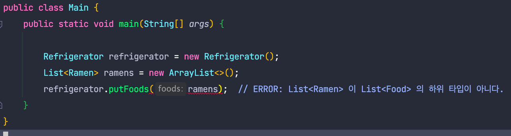

자바의 제네릭은 무공변이기 때문에 위와 같은 코드가 실패하는 것을 알 수 있습니다.

만약 제네릭이 공변성을 가지게 한다면 위 문제가 해결될 것 같은데 방법이 없을까요??

자바에서는 이러한 문제를 해결하기 위해 **한정적 와일드카드 타입**이라는 특별한 매개변수화된 타입을 제공합니다.

<br>
<br>
<br>
<br>

## 🧐 extends - 제네릭을 공변으로 만들기

위의 **putFoods**의 파라미터 타입은 'Food의 List'가 아니라, '**Food의 하위 타입**의 List'여야 합니다.

> **Ramen**이 **Food**의 하위 타입일 때, List<**Ramen**> 도 List<**Food**>의 하위 타입인 경우, 이를 **공변**이라 합니다.

이를 **extends**를 사용하여 해결할 수 있는데, 다음과 같습니다.

> **Ramen**이**Food**의 하위 타입일 때,
>
> 1. 무공변 : List<**Ramen**\>은 List<**Food**\>의 하위 타입도, 상위 타입도 아니다.
>
> 2. **공변** :List<**Ramen**\>은 List<**?** **extends** **Food**\>의 **하위** 타입이다.

이제 직접 코드에 적용하여 위 문제를 해결해 보도록 하겠습니다.

```java
public class Food {
}

// 김치
public class Kimchi extends Food {
}

// 라면
public class Ramen extends Food {
}

// 냉장고
public class Refrigerator {

    private final List<Food> foods = new ArrayList<>();

    /* extends를 통해 공변 적용 */
    public void putFoods(final List<? extends Food> foods) {
        this.foods.addAll(foods);
    }
}
```

위와 같이 코드를 수정하면, 이전 코드는 다음과 같이 문제없이 컴파일에 성공하는 것을 알 수 있습니다.

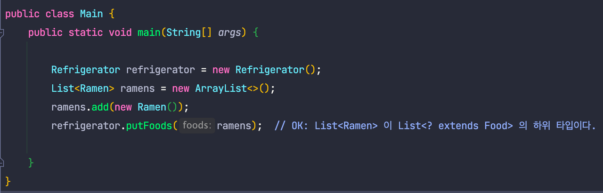

그럼 이제 문제가 없을까요???


<br>
<br>
<br>
<br>

## 🧐 반공변이 필요한 경우

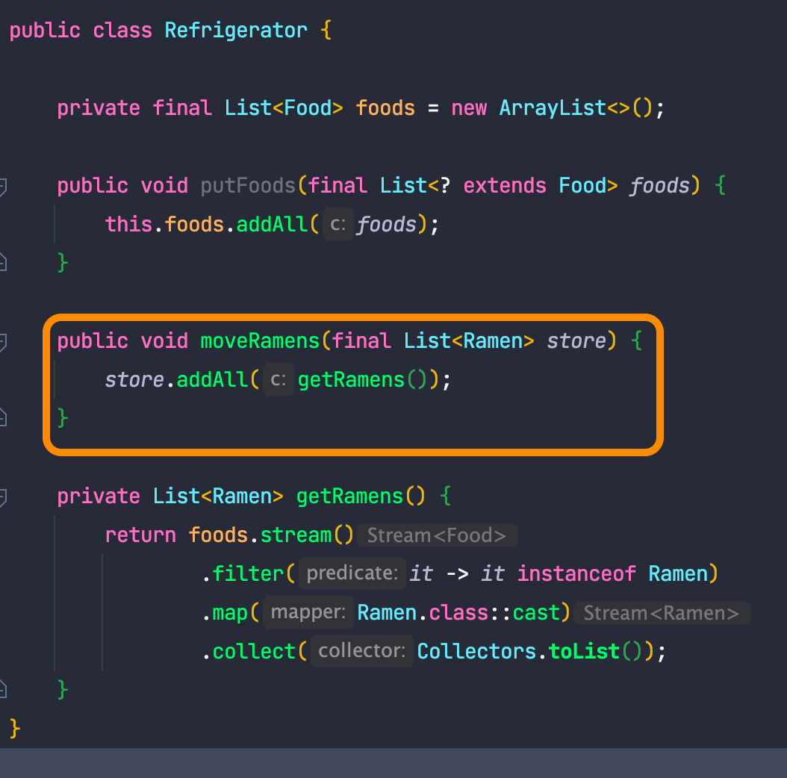

냉장고가 가진 라면을 라면을 저장할 수 있는 List로 이동시키는 코드를 작성해 보았습니다.

이제 외부에서 다음과 같이 코드를 작성하였습니다.

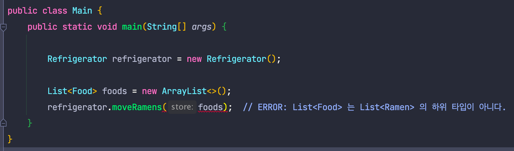

자바에서 매개변수에는 동일한 타입, 혹은 하위 타입의 변수만을 넣을 수 있지만, List<Food>는 List<Ramen>의 하위 타입이 아니기 때문에 위와 같이 사용할 수 없습니다.

이러한 문제는 **super**를 통해 **반공변**으로 만들어 줌으로써 해결할 수 있습니다.

<br>
<br>
<br>
<br>

## 🧐 super - 제네릭을 반공변으로 만들기

위의 **moveRames**은 라면을 옮기는 것이기에, 라면을 받을 수 있는 라면의 상위 타입이 리스트로 들어오면 됩니다.

즉 파라미터 타입은 'Ramen의 List'가 아니라, '**Ramen 의 상위 타입**의 List'여야 합니다.

> Ramen이 Food의 하위 타입일 때, List<Ramen> 은 List<Food>의 상위 타입인 경우, 이를 반공변이라 합니다.

이를 **super**를 사용하여 해결할 수 있는데, 다음과 같습니다.

> **Ramen**이 **Food**의 하위 타입일 때,
>
> 1\. 무공변 : List<**Ramen**\>은 List<**Food**\>의 하위 타입도, 상위 타입도 아니다.
>
> 2. 공변:List<**Ramen**\>은 List<? extends **Food**\>의 하위 타입이다.
>
> 3\. **반공변** : List<**Food**\>는 List<**? super** **Ramen**\>의 **하위 타입**이다.  
> (즉 List<? super **Ramen**\>은 List<**Food**\>의 상위 타입이다.)  
> (즉 List<? super **Ramen**\> = List<**Food**\>가 성립한다.)

이제 직접 코드에 적용하여 위 문제를 해결해 보도록 하겠습니다.

```java
public class Food {
}

// 김치
public class Kimchi extends Food {
}

// 라면
public class Ramen extends Food {
}

// 냉장고
public class Refrigerator {

    private final List<Food> foods = new ArrayList<>();

    public void putFoods(final List<? extends Food> foods) {
        this.foods.addAll(foods);
    }

    /* super를 통해 반공변 적용 */
    public void moveRamens(final List<? super Ramen> store) {
        store.addAll(getRamens());
    }

    private List<Ramen> getRamens() {
        return foods.stream()
                .filter(it -> it instanceof Ramen)
                .map(Ramen.class::cast)
                .collect(Collectors.toList());
    }
}
```

위와 같이 코드를 수정하면, 이전 코드는 다음과 같이 문제없이 컴파일에 성공하는 것을 알 수 있습니다.

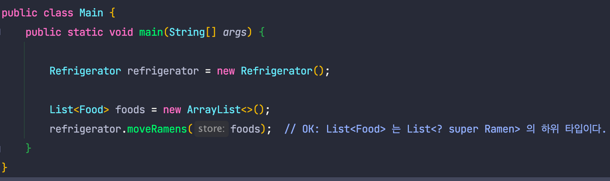

<br>
<br>
<br>
<br>

## 🧐 PECS

이펙티브 자바에서는 PECS라는 단어를 설명하는데, 이는 다음과 같습니다.

> PECS : producer-extends, consumer-super

즉 값을 생성한다면 extends를, 값을 소비한다면 super를 사용하라는 것인데, 이 생성과 소비가 무엇인지 예시를 통해 알아보도록 하겠습니다.

지금까지 살펴본 코드를 해당 예시를 통해 이해하기 쉽게 바꾸도록 하겠습니다.

(절대 이전 예제 사진을 바꾸기 귀찮아서 이제와서 코드만 바꾸는거 맞습니다.)

냉장고(Refrigerator) 예시만 바꾸면 됩니다.

```java
public class Refrigerator {

    private final List<Food> foods = new ArrayList<>();

    public void putFoods(final List<? extends Food> foods) {
        for (Food food : foods) {
            this.foods.add(food);
        }
    }

    public void moveRamens(final List<? super Ramen> store) {
        List<Ramen> ramens = getRamens();
        for (Ramen ramen : ramens) {
            store.add(ramen);
        }
    }

    private List<Ramen> getRamens() {
        return foods.stream()
                .filter(it -> it instanceof Ramen)
                .map(Ramen.class::cast)
                .collect(Collectors.toList());
    }
}
```

위 코드는 이전 예시와 동일한 코드이며, 이제 이를 생성자와 소비자가 강조되도록 바꾸면 다음과 같습니다.

```java
public class Refrigerator {

    private final List<Food> foods = new ArrayList<>();

    public void putFoods(final List<? extends Food> producer) {
        for (Food produced : producer) {
            this.foods.add(produced);  // producer 는 내가 소비할 Food 를 생산합니다.
        }
    }

    public void moveRamens(final List<? super Ramen> consumer) {
        List<Ramen> ramens = getRamens();
        for (Ramen ramen : ramens) {
            consumer.add(ramen);  // consumer 는 내가 생산한 값을 소비하는 소비자입니다. 
        }
    }

    private List<Ramen> getRamens() {
        return foods.stream()
                .filter(it -> it instanceof Ramen)
                .map(Ramen.class::cast)
                .collect(Collectors.toList());
    }
}
```

즉 어떤 제네릭 타입의 메서드가, 해당 제네릭 타입을 return하면 Producer 이고,
어떤 제네릭 타입의 메서드가, 제네릭 타입을 인자로 사용하는 경우 Consumer 입니다.

이는 [Oracle 공식 가이드라인](https://docs.oracle.com/javase/tutorial/java/generics/wildcardGuidelines.html)에도 나와있는 내용입니다.

<br>
<br>
<br>
<br>

## 🧐 반환 타입으로는 한정적 와일드카드를 사용하면 안됩니다.

만약 사용한다면 발생하는 상황을 살펴보도록 하겠습니다.

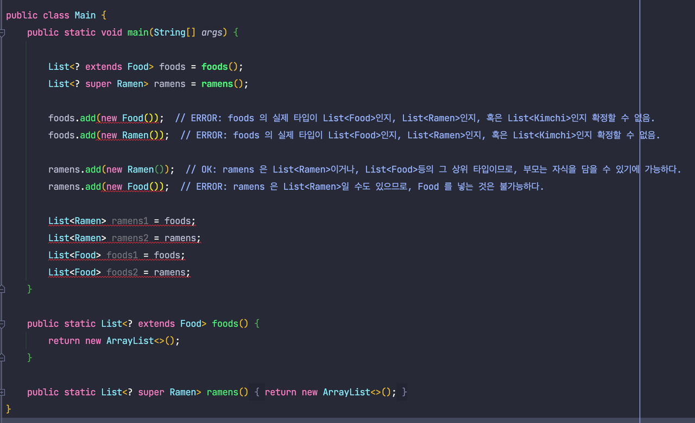

위와 같이 반환 타입으로 와일드카드를 사용한다면, 유연성이 높아지기는 커녕 클라이언트 코드에서도 와일드카드 타입을 사용해야 하며,

이는 정말 많은 제약이 따르게 됩니다.

> 클래스 사용자가 와일드카드 타입을 신경써야 한다면 그 API에 무슨 문제가 있을 가능성이 높습니다.

<br>
<br>
<br>
<br>

## 🧐 지금까지 학습한 내용 정리하기

잠시 중간 점검에 들어가겠습니다.

아래 코드는 Collections의 max 메서드입니다.

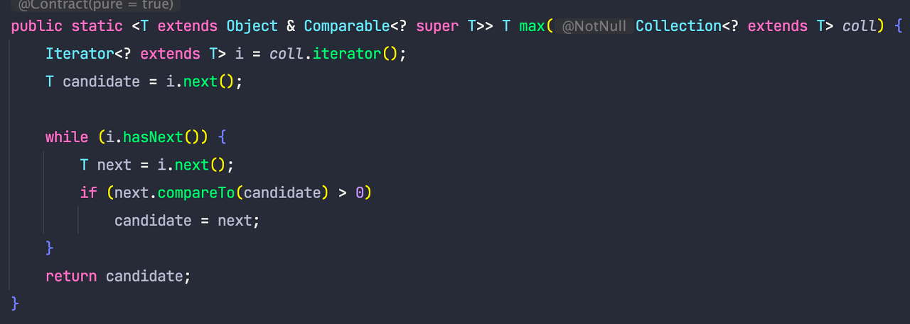

하나하나 해당 메서드를 살펴보도록 하겠습니다.

<T **extends** Object & Comparable<? **super** T>> 부터 살펴보겠습니다.

우선 Comparable<? **super** T>가 의미하는 것은, Comparable이 T를 소비할 거라는 사실을 예상할 수 있습니다.

```java
public interface Comparable<T> {

    public int compareTo(T o);  // 인자로 들어오는 T를 소비한다.
}
```

Comparable은 위와 같이 언제나 소비자이므로, 가급적 Comparable<E> 보다는 Comparable<? super E>를 사용하는 것이 좋습니다.

다시 <T **extends** Object & Comparable<? **super** T>>로 돌아오면, 결국 T는 Object 의 하위 타입 중, Comparable을 구현한 어떤 것이라는 것을 알 수
있습니다.

(Object는 없어도 될 텐데 왜 달아준지는 모르겠습니다.)

이제 다음으로 파라미터인 Collection<? extends T> call을 보면, 이는 call이 생산자임을 알 수 있습니다.

실제로 내부에서 call이 생산해 주는 값을 사용하는 것을 알 수 있습니다.(i.next())

<br>
<br>
<br>
<br>

## 🧐 와일드카드는 언제 사용하여야 할까?

공변, 반공변 처리를 하는 상황을 제외하고, 타입 매개변수와 와일드카드에는 공통되는 부분이 있어서,

메서드를 정의할 때 두 가지 방법 중 어느 방식을 사용해도 문제가 없는 경우가 있습니다.

```java
static boolean isEmpty1(final List<?> list){
        return list.isEmpty();
        }

static<T> boolean isEmpty2(final List<T> list){
        return list.isEmpty();
        }
```

```java
static<T> long frequency1(final List<T> list,T elem){
        return list.stream().filter(it->it.equals(elem)).count();
        }

static long frequency2(final List<?> list,Object elem){
        return list.stream().filter(it->it.equals(elem)).count();
        }
```

위 두 예시는 모두 정상 작동하는 메서드입니다.

이러한 상황에서 타입 매개변수를 사용할지, 혹은 와일드카드를 사용할지에 대해 이펙티브 자바에서는 기본적으로 다음과 같이 설명합니다.


> 메서드 선언에 타입 매개변수가 한 번만 나오면 와일드 카드로 대체하라

그러나 이 역시 문제되는 경우가 있을 수 있습니다.

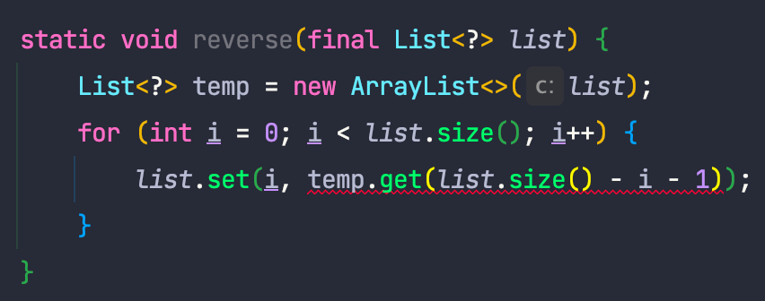

위의 예시는 list에 들어있는 원소들의 순서를 반대로 뒤집는 메서드이며, 타입 매개변수가 하나만 사용되기 때문에 와일드카드를 사용한 경우입니다.

그러나 컴파일 에러가 나는 것을 알 수 있는데, 다음과 같은 이유로 예외가 발생합니다.

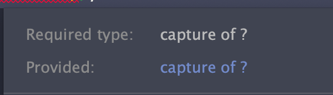

이런 경우 해결할 수 있는 방법으로는 아래 두 가지 방법이 있습니다.

<br>
<br>

1\. 와일드카드 대신 타입 파라미터를 사용한다.

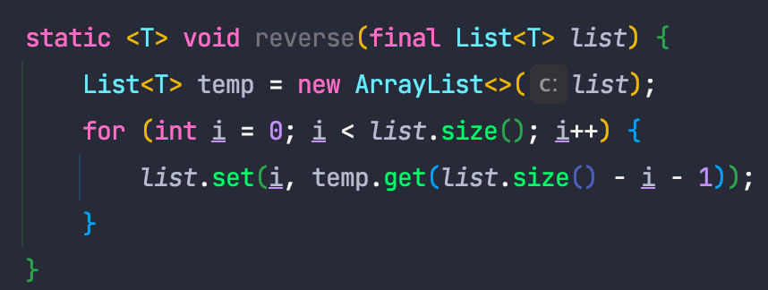

<br>
<br>

2\. 도우미 메서드를 만든다.

이는 [자바 공식 튜토리얼](https://docs.oracle.com/javase/tutorial/java/generics/capture.html)과, 이펙티브 자바에도 나오는 내용으로, 다음과 같습니다.

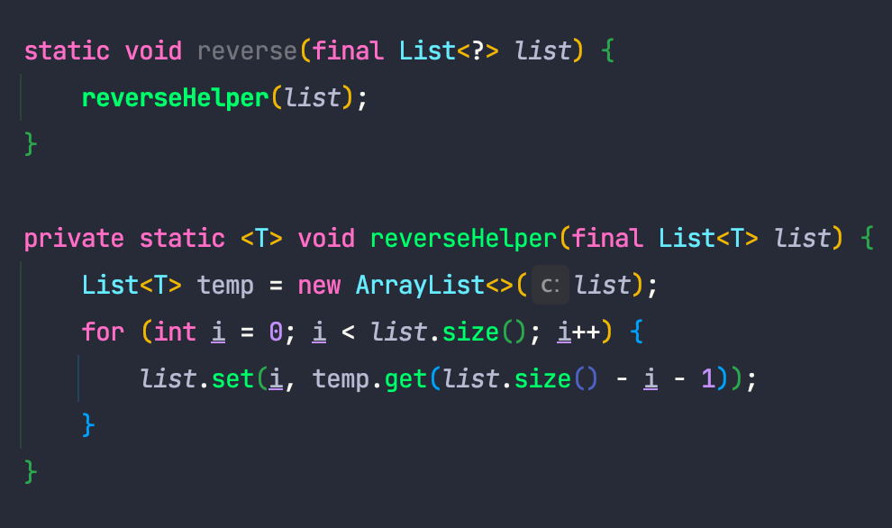

reverseHelper라는 도우미 메서드를 만들어서, 와일드카드에 대해 캡처할 수 있도록 하는 방법입니다.

이는 와일드카드 대신 타입 파라미터를 사용한 코드와 정확히 똑같은 코드이기 때문에 다음과 같은 의문이 들 수 있습니다.

> 그럼 그냥 처음부터 타입 파라미터를 쓰지 왜 굳이 Helper 메서드를 만들어야 하냐?

제네릭 메서드를 쓰는 경우는, 타입 파라미터 정의된 요소에 대해 관심이 있다는 것을 의미합니다. (t를 사용하여 무엇인가를 함, List를 예시로 들면, add를 하거나, remove를 하는 등)

API를 직접 사용하는 클라이언트 입장에서는, `<T>` 와 같이 타입 파라미터를 직접 노출하는 코드는 api 내부 구현에 대한 오해를 불러 일으킬 수 있습니다. (T를 사용하지 않지만, T에 대해 관심이 있다고 오해할
수 있음)

그러나 위와 같은 경우 T가 무엇이든 T를 사용하지 않기 때문에 T에는 관심이 없는 코드이며, 따라서 와일드카드로 선언하는 것이 사용자 입장에서 의도를 파악하기 쉬워집니다.

따라서 위와 같은 상황에서는 도우미 메서드를 제공하여 public api에는 와일드카드를 사용하는 메서드를 제공하는 것이 의도에 더 알맞다고 합니다.

<br>
<br>
<br>
<br>