# Item 32 제네릭과 가변인수를 함께 쓸 때는 신중하라

## **🟦 가변인수 (Varargs)**

가변인수는 필요에 따라 매개변수의 개수를 동적으로 조정할 수 있는 기능입니다.

덕분에 메서드를 n번 오버로딩 하지않아도 됩니다.

가변인수 사용하는 방법은 **타입... 매개변수명** 으로 사용하면 됩니다.

가변인수 메서드를 호출하면 가변인수를 담기위해

파라미터로 넘겨진 값들을 컴파일러가 컴파일 타임에 **배열**을 만들고 데이터를 삽입해주는 방식입니다.

```java
@Test
void 오버로딩과_가변인수() {
    say("안녕1");
    say("안녕1", "안녕2");
    say("안녕1", "안녕2", "안녕3");
    say("안녕1", "안녕2", "안녕3", "안녕4", "안녕5", "안녕6", "안녕7", "안녕8", "안녕9");
}

void say(String s1) {
}

void say(String s1, String s2) {
}

void say(String s1, String s2, String s3) {
}

void say(String... args) {
}
```

<br>
<br>
<br>

## **🟦 제네릭과 가변인수**

그렇다면 제네릭과 가변인수를 같이 사용하면 유용하지 않을까요 ?

#### **매개변수화 타입과 가변인수**

예시를 들어보겠습니다.

여러 그룹이 있고 각각 그룹원들의 이름을 가지고 있습니다.

이 때 첫 번째 그룹의 이름 목록을 번호 목록으로 수정하려고 하는 상황입니다.

```java
@DisplayName("첫 번째 그룹에 속한 그룹원들의 이름을 번호로 바꿀 때 ClassCastException 예외가 발생한다.")
@Test
void 제네릭과_가변인수() {
    assertThatThrownBy(() -> changeGroupNameToNumber(List.of("헤나", "하이에나"), List.of("누렁이", "백구")))
            .isInstanceOf(ClassCastException.class);
}

static void changeGroupNameToNumber(List<String>... groups) {
    List<Integer> firstGroupNumbers = List.of(1, 2);
    Object[] objects = groups;
    objects[0] = firstGroupNumbers;
    String firstPersonNumber = groups[0].get(0);
}
```

> 1 번째 그룹에 있는 ["헤나", "하이에나"]를 [1, 2]로 수정하고 있습니다.  
> 먼저 매개변수화 타입이 `List<String>`에는 매개변수화 타입 `List<Integer>`가 들어갈 수 없으므로  
> **groups**를 `Object[]` 로 변환해서 firstGroupNumber를 집어넣겠습니다.

억지 느낌이 있지만 중요한 것은 컴파일 시점에 경고를 발생시켜준다는 점입니다.

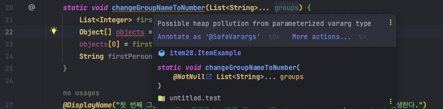

그리고 그룹원 이름 목록을 번호 목록으로 변환시킨 후

첫 번째 그룹원의 번호를 가져오려고 할 때 **ClassCastException** 예외 테스트가 성공함을 볼 수 있습니다.

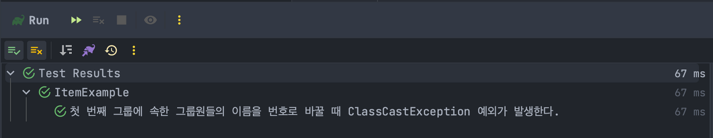

<br>
<br>
<br>

> 🤔 그렇다면 왜 경고를 발생시키고 예외까지 일어났을까요 ?

먼저 제네릭과 가변인수를 같이 사용하면 타입이 불안정 할 수 있습니다.

가변인수 (`List<String>...`) 작성시 (`List<String>`)를 담기 위한 배열(`List<String>[]`)이 내부로 감춰지지 않아 노출되고

가변인수 매개변수에 제네릭이나 매개변수화 타입이 포함되면 **실체화 불가 타입으로 추론**된다고 경고합니다.

<br>
<br>
<br>

> 🤔 실체화 불가 타입이요?

제네릭은 **실체화 불가 타입**입니다. (ex. `T`, `List<T>`, `List<String>`)

이들은 실체화되지 않아서 런타임에는 컴파일 타임보다 타입 정보를 적게 갖습니다.

**타입 소거(Type Erasure)** 되기 때문입니다.

간단하게 설명하자면

**제네릭은 런타임에 타입에 대한 정보가 소거됩니다.**

컴파일러는 코드를 검사하고 타입 오류가 없으면 제네릭을 `Object` 타입으로 치환하여 소거한다는 의미입니다.

때문에 제네릭 컬렉션은 자신의 원소 타입을 담은 배열을 반환하는게 대부분 불가능 합니다.

만약 제네릭 타입과 가변인수 메서드가 함께 쓰인다면 경고 메시지를 받게됩니다.

```
Possible heap pollution from parameterized vararg type List<String>
```


경고의 의미는 가변인수 메서드를 호출 할 때 가변인수 매개변수를 담아줄 배열을 생성하는데,

배열의 원소가 실체화 불가 타입일 때 경고 메시지를 띄어주는 것입니다.

다시 **"🟦 제네릭과 가변인수"** 에 있는 코드를 보신다면

```java
static void changeGroupNameToNumber(List<String>... groups)
```

가변인수 매개변수 `List<String>`들을 담아줄 배열 `List<String>[]` 을 생성하게 되는데

런타임 시점에 제네릭의 타입 정보가 소거 되므로 실체화 불가 타입이 됐던것입니다.

매개변수화 타입 `List<String>`이 다른 타입의 객체를 참조하면 **Heap Pollution**이 발생하는데

이유는 타입 정보가 소거되었기 때문에 컴파일러가 자동 생성한 형변환에 실패할 수 있기 때문입니다.

그리고 실제로 **changeGroupNameToNumber** 메서드 4번째 라인에서 형변환 실패로 인해 **ClassCastException**이 발생했습니다.

```java
static void changeGroupNameToNumber(List<String>... groups) {
    List<Integer> firstGroupNumbers = List.of(1, 2);
    Object[] objects = groups;
    objects[0] = firstGroupNumbers;
    String firstPersonNumber = groups[0].get(0); // ClassCastException
}
```

런타임에 첫 번째 그룹을 매개변수화 타입 `List<Integer>`로 변경한 후에 `Integer` 타입 자료를 `String` 타입으로 강제 형변환 했습니다.

두 타입이 다르고 상위-하위 타입 관계가 아니기에 `Integer`와 `String` 형변환에서 예외가 발생하게 된 것입니다.

(*Heap Pollution : JVM의 메모리 공간인 heap area에 문제가 생겼음을 의미한다.)

**결과적으로는 제네릭과 가변인수를 같이 사용하니 타입 안정성이 깨질 수도 있다는 것을 확인할 수 있었습니다.**

<br>
<br>
<br>

## **🟦 제네릭 배열, 제네릭 varargs 매개변수**

> 🤔 제네릭 배열 생성은 안되지만, 제네릭 varargs 배열은 왜 가능할까요 ?

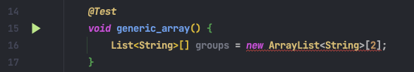
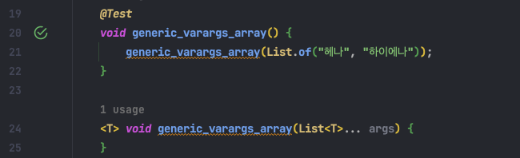

**사실 제네릭 varargs 배열이 가능한 이유는 단순히 실무에서 유용했기 때문입니다.**

책에서 나온 대표적인 예시들입니다.

-   Arrays.asList(T... a)
-   Collections.addAll(Collection<? super T> c, T... elements)
-   EnumSet<E> of(E first, E... rest)

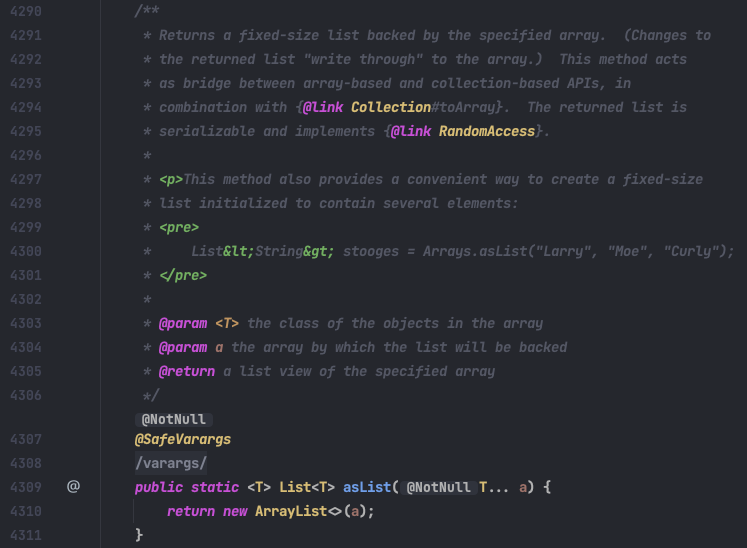
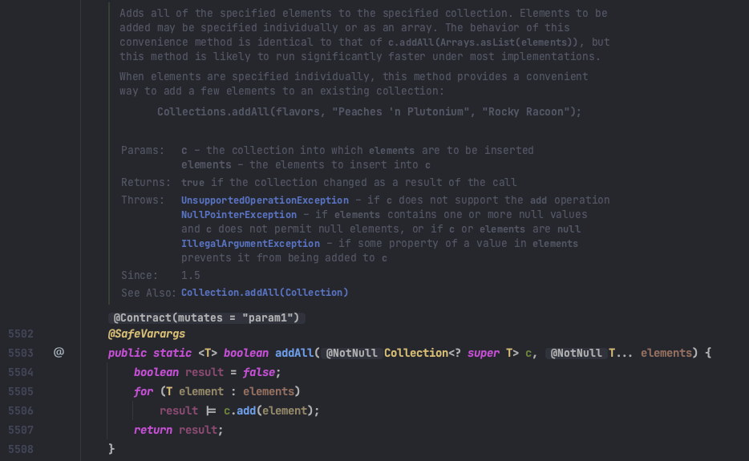
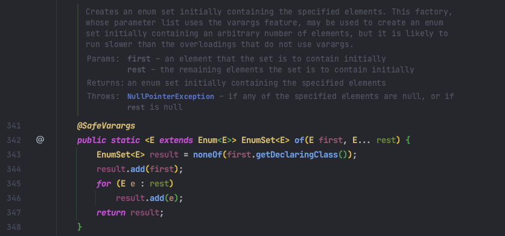

<br>
<br>
<br>

> 🤔 왜 이 메서드들은 타입 안전하다고 할까요 ?

"🟦 제네릭과 가변인수"에서 타입이 안전하지 않게 된 이유를 기억하시나요 ?

-   이유는 컴파일 타임에 가변인수 varargs의 원소를 담기 위한 배열을 만드게 되는데 그 배열이 노출되기 때문이었습니다.

노출이 왜 위험했는지도 기억하시나요 ?

-   varargs의 원소가 다른 타입의 객체를 참조하면 타입 소거 때문에 컴파일러가 자동 생성한 형변환에 실패할 수 있기 때문입니다.

`Collections.addAll` 메서드 코드를 한 번 봐볼까요 ?

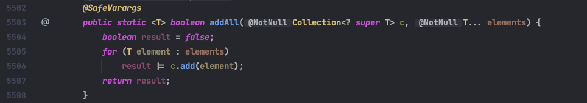

`T... elements`로 제네릭과 가변인수를 같이 사용하여 매개변수로 이용했습니다.

컴파일 타임에 `T` 원소를 담기 위한 `T[]`이 만들어졌지만

`T[]`에 아무것도 저장하지 않고 외부로 노출되지도 않았습니다.

<br>
<br>
<br>

💡 정리하면

**1. varargs 매개변수를 담는 제네릭 배열에 아무것도 저장하지 않는다.**

**2. varargs 매개변수를 담는 제네릭 배열이 외부로 노출되지 않는다.**

라는 조건에 만족해서 Collections.addAll 메서드는 안전하다고 할 수 있습니다.

<br>
<br>
<br>

> 🤔 @SafeVarargs 라는 어노테이션은 무슨 일을 하고 있나요 ?

`@SafeVarargs`는 메서드가 타입 안전함을 의미하는 어노테이션입니다.

이를 작성함으로서 발생하는 경고를 숨기는 기능을 가지고 있습니다.

<br>
<br>
<br>

## **🟦 제네릭과 가변인수를 이용한 타입 안전한 메서드**

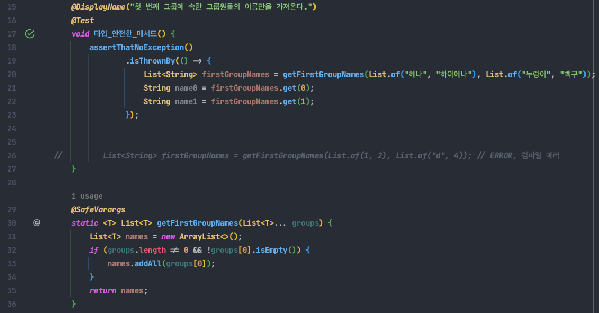
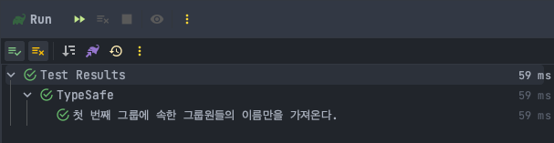

위에 나온 `getFirstGroupNames`는 타입 안전한 메서드입니다.

`List<? extends T>[]`에 아무것도 저장하지 않고

`List<? extends T>[]`은 외부로 노출되지 않습니다.

단지 첫 번째 데이터를 가져오는 것만을 수행하기 때문에 타입 안전한 메서드라고 할 수 있습니다.

만약 제네릭 타입 `List<T>`에 서로 다른 실체 타입 매개변수가 들어간다면 컴파일 시점에 에러를 발생시켜주고 있습니다.

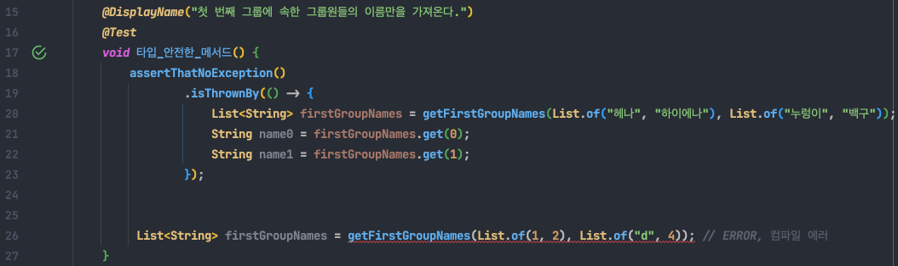

<br>
<br>
<br>

## 🟦 배열 없이 제네릭만 사용하여 타입 안전한 메서드

**"🟦** **제네릭과 가변인수를 이용한 타입 안전한 메서드"** 에서

제네릭 타입 `List<T>` 가변인수 보다 `List`를 활용하면 보다 안정적인 메서드를 작성할 수 있습니다.

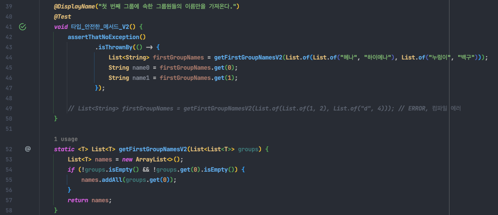

`List`를 활용하면 컴파일러가 내부에서 새로운 배열을 생성할 필요 없이 제네릭만 사용할 수 있으므로 타입 안전합니다.또한 제네릭과 가변인수를 같이 사용하면서 발생할 수 있는 위험을 피할 수 있습니다.

`List.of`도 사실 제네릭과 가변인수를 같이 사용한 메서드이지만 `@SafeVarargs`가 있는 타입 안전한 메서드이니 걱정하지 않아도 됩니다.

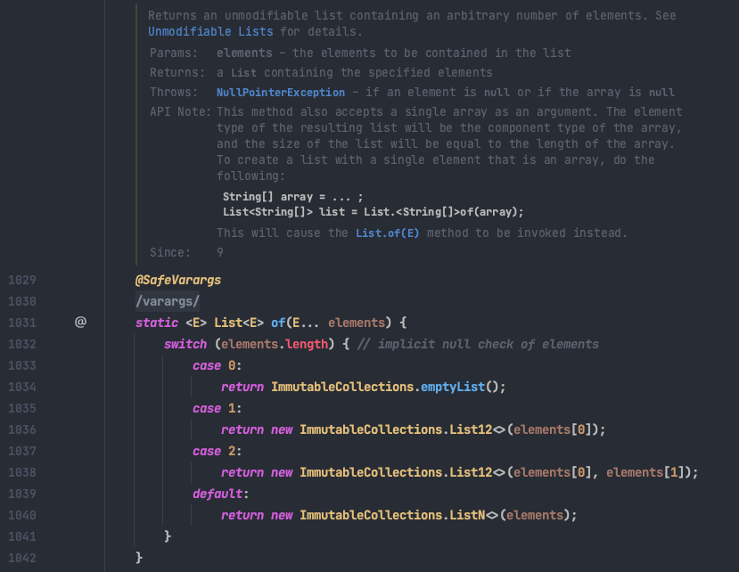

<br>
<br>
<br>

## 🟦 가변인수와 제네릭의 조합

정리해보면

가변인수와 제네릭의 조합은 좋지 않습니다.

배열과 제네릭은 타입 규칙이 다르며 가변인수는 배열을 노출시키기 때문에 타입 안전하지 않기 때문이었습니다.

제네릭 배열은 직접 생성하지 못하지만 제네릭 varargs 배열은 생성된다는 모순도 있었습니다.

이는 편리함 때문에 막아놓지 않은 것이고 대표적인 예시는 다음과 같았습니다.

-   Arrays.asList(T... a)
-   Collections.addAll(Collection<? super T> c, T... elements)
-   EnumSet.of(E first, E... reset)

안전하게 사용하기 위해서는 항상 메서드가 타입 안전한지 확인하고 `@SafeVarargs` 어노테이션을 이용합시다.