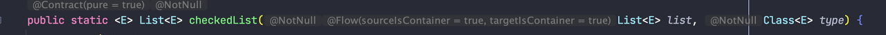
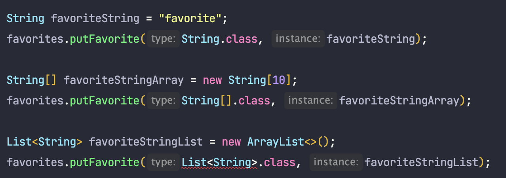
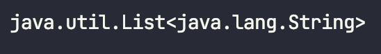

<br><br>

## 🧐 리터럴과 클래스 리터럴

**리터럴**(Literal)은 소스 코드 상에 직접적으로 나타나는 **데이터 값 그 자체**를 의미합니다.

예를 들어, 정수형 리터럴은 23과 같이 숫자로 이루어진 값이며, 문자열 리터럴은 "hello world" 와 같이 따옴표로 감싸진 문자열 값입니다.

클래스 리터럴은 클래스의 이름을 참조하는 방식으로 사용됩니다. 예를 들어, String.**class** 와 같이 클래스 이름 뒤에 **.class**를 붙여서 사용됩니다.

그리고 이러한 클래스 리터럴의 타입은  `Class<T>` 입니다.


예를 들어 **String**.class의 타입은 Class<**String**>, **Integer**.class의 타입은 Class<**Integer**>인 것입니다.

```java
final Class<String> stringClass = String.class;
final Class<Integer> integerClass = Integer.class;
```

<br><br><br>

## 🧐 타입 토큰

컴파일시의 타입 정보와, 런타임시의 타입 정보를 알아내기 위해 메서드들이 주고받는 클래스 리터럴을 **타입 토큰**이라고 합니다.

타입 토큰은 주로 제네릭 타입을 사용하는 메서드나 클래스에서 타입 정보를 전달하는 용도로 사용됩니다.

조금 더 범용적으로 표현하자면, 타입 토큰은 대체로 **타입 안정성**이 필요한 곳에 사용되는데 대표적인 예시로는 RestTemplate 혹은 ObjectMapper등이 있습니다.

```
MyLittleTelevision mlt = objectMapper.readValue(jsonString, MyLittleTelevision.class);
```

<br><br><br>

## 🧐 제네릭의 일반적인 쓰임

제네릭은 Set<E>, Map<K, V> 등의 컬렉션과, `ThreadLocal<T>`, `AtomicReference<T>` 등의 단일원소 컨테이너에서 흔히 사용됩니다.

이러한 모든 쓰임에서 매개변수화되는 대상은 컨테이너 자신인데, 예를 들어 ThreadLocal의 경우, `ThreadLocal<Integer>` 등과 같이 **컨테이너 자신**을 매개변수화합니다.

따라서 하나의 컨테이너에서 **매개변수화할 수 있는 타입의 수가 제한**됩니다.

예를 들어 `Set<E>`의 경우, 원소의 타입을 뜻하는 단 하나의 타입 매개변수만을 필요로 하며, Map<K, V>는 키와 값을 뜻하는 두개의 타입 매개변수가 필요한 식입니다.

<br><br><br>

## 🧐 타입 안전 이종 컨테이너 패턴

그러나 종종 한가지 타입이 아닌 여러 타입의 인스턴스에 대해서 각각을 타입 안전하게 사용할 수 있도록 하는 수단이 필요한 경우가 있습니다.

이를 위한 쉬운 해법으로는 컨테이너 대신 **키를 매개변수화**한 다음, 컨테이너에 값을 넣거나 뺄 때 매개변수화한 키를 함께 제공하는 것입니다.

이렇게 하면 제네릭 타입 시스템이 값의 타입이 키와 같음을 보장해줄 것입니다.

간단한 예시로 타입별로 즐겨 찾는 인스턴스를 저장하고 검색할 수 있는 Favorites 클래스를 다음과 같이 작성해 보았습니다.

```java
import java.util.*;

public class Favorites {

    private Map<Class<?>, Object> favorites = new HashMap<>();

    public <T> void putFavorite(Class<T> type, T instance) {
        favorites.put(Objects.requireNonNull(type), instance);
    }
    public <T> T getFavorite(Class<T> type){
        return type.cast(favorites.get(type));
    }
}
```

각 타입의 Class 객체를 매개변수화한 Key로 사용하여, 해당 타입에 맞는 인스턴스를 저장하도록 구현하였습니다.

이를 사용하는 예시는 다음과 같습니다.

```java
Favorites f = new Favorites();

f.putFavorite(String.class, "Java");
f.putFavorite(Integer.class, 22);
f.putFavorite(Class.class, Favorites.class);

final String favorite = f.getFavorite(String.class);  // java
final Integer favorite1 = f.getFavorite(Integer.class);  // 22
final Class<?> favorite2 = f.getFavorite(Class.class);  // Class<Favorites>
```

<br><br><br>

## 🧐 타입 안전 이종 컨테이너 패턴의 문제점

<br><br>

### 😡 Class 객체를 제네릭이 아닌 로 타입으로 넘기는 경우, 타입 안정성이 깨집니다.

예를 들어 클라이언트 코드를 다음과 같이 작성하는 경우입니다.

```java
f.putFavorite((Class)Integer.class, "Integer의 인스턴스가 아닙니다.");

int fInt = f.getFavorite(Integer.class);  // ClassCastException 발생
```

만약 Favorites가 타입 불변식을 어기는 일이 없도록 보장하기 위해서는 아래와 같이 putFavorite 메서드에서 인수로 주어진 instance 타입이 type으로 명시한 타입과 같은지 확인하면 됩니다.

```java
public <T> void putFavorite(Class<T> type, T instance) {
    favorites.put(Objects.requireNonNull(type), type.cast(instance));
}
```

이러한 방식을 적용한 대표적 예시로는 Collections의 checkedSet, checkedList, checkedMap등이 있습니다.



이들은 컬렉션(혹은 Map)과 함께 1개의(혹은 2개) Class 객체를 받습니다.

이 메서드들은 모두 Class 객체와 컬렉션의 컴파일타임 타입이 같음을 보장합니다.

<br><br>

### 😡 실체화 불가 타입에는 사용할 수 없습니다.

**실체화 불가 타입**은 E, `List<E>`, `List<String>`등와 같이 실체화되지 않으며, 런타임에는 컴파일타임보다 타입 정보를 적게 가지는 타입입니다.

즉 즐겨 찾는 String 이나, String[ ] 은 저장할 수 있지만, 즐겨 찾는 `List\<String>` 은 저장할 수 없습니다.



위와 같은 오류가 발생하는 이유는 `List<String>` 용 Class 객체를 얻을 수 없기 때문입니다.

`List<String>`에 대한 Class 는 얻을 수 없지만, `List`에 대한 Class 객체는 얻을 수 있으므로, 위 코드는 다음과 같이 변경할 수 있습니다.

```java
List<String> favoriteStringList = new ArrayList<>();
favorites.putFavorite(List.class, favoriteStringList);
```

그러나 `List<String>`과, `List<Integer>` 등 모든 `List<T>` 의 클래스 리터럴은 `Class<List>` 이므로, 다음과 같이 코드가 작성된다면, 타입 안정성이 깨지게됩니다.

```java
List<String> favoriteStringList = new ArrayList<>();
favoriteStringList.add("f1");

List<Integer> favoriteIntegerList = new ArrayList<>();
favoriteIntegerList.add(1);

favorites.putFavorite(List.class, favoriteStringList);
favorites.putFavorite(List.class, favoriteIntegerList);

final List<Integer> favorite1 = favorites.getFavorite(List.class);
System.out.println(favorite1.get(0));

final List<String> favorite2 = favorites.getFavorite(List.class);
System.out.println(favorite2.get(0));  // ClassCastException
```

이러한 두 번째 문제점에 대해서는 완벽히 만족스러운 우회로는 없다고 하지만, 어느정도 해결하는 방법은 있습니다.

바로 **슈퍼 타입 토큰**(Super type token)을 사용하는 것입니다.

<br><br><br>

## 🧐 슈퍼 타입 토큰

앞서 살펴본 것 처럼, `List<String>`과 같은 실체화 불가 타입에 대한 타입 정보는 얻어낼 방법이 없었습니다.

그러나 **이를 가져올 수 있는 경우**가 있는데 바로 제네릭 클래스를 수퍼타입으로 사용하는 경우입니다.

예시를 통해 확인하겠습니다.

```java
public class SuperTypeToken {

    static class Sup<T> {
        T value;
    }

    public static void main(String[] args) throws NoSuchFieldException {
        Sup<String> s = new Sup<>();

        System.out.println(s.getClass().getDeclaredField("value").getType()); // class java.lang.Object
    }
}
```

위와 같이 Reflection을 사용하더라도, 런타임 시에는 T가 Type Eraser에 의해 제거되므로 타입 정보를 알 수 없습니다.

그러나 아래와 같이 수퍼 타입을 활용한다면, 지금까지 가져오지 못했던 `List<String>` 등의 타입 정보 또한 가져올 수 있습니다.

```java
class Sup<T> {}

class Sub extends Sup<List<String>> {}
```

이제 List<String>에 대한 정보를 가지고 와 볼 것인데, 이는 Class의 **getGenericSuperclass**() 메서드를 통해서 가능합니다.

우선 사용 예시는 다음과 같습니다.

```java
class Sup<T> {}

class Sub extends Sup<List<String>> {}

public class SuperTypeToken {

    public static void main(String[] args) {
        final Sub sub = new Sub();

        final Type t = sub.getClass().getGenericSuperclass(); // SuperTypeToken$Sup<java.util.List<java.lang.String>>
        ParameterizedType parameterizedType = (ParameterizedType) t;
        System.out.println(parameterizedType.getActualTypeArguments()[0]);
    }
}
```



<br><br><br>

### 📕 Class.getGenericSuperclass()

위 메서드의 설명을 보면 다음과 같습니다.

> Returns the Type representing the direct superclass of the entity (class, interface, primitive type or void) represented by this Class object. If the superclass is a parameterized type, the Type object returned must accurately reflect the actual type arguments used in the source code. The parameterized type representing the superclass is created if it had not been created before. See the declaration of ParameterizedType for the semantics of the creation process for parameterized types. If this Class object represents either the Object class, an interface, a primitive type, or void, then null is returned. If this Class object represents an array class then the Class object representing the Object class is returned. Returns: the direct superclass of the class represented by this Class object 
>

요약하면 다음과 같습니다.

> 이 Class가 나타내는 엔티티(클래스, 인터페이스 등)의 직접적인 슈퍼클래스의 타입을 반환한다.  
> 바로 위의 **슈퍼클래스가 파라미터화된 타입(ParameterizedType)** 이면, **실제 타입 타라미터들을 반영한 타입**을 반환해야 한다.

그러나 위의 예시에서 살펴본 것 처럼, 슈퍼 타입 토큰을 활용하는 코드는 너무 복잡합니다.

따라서 이를 조금 편하게 사용할 수 있도록 익명 클래스를 활용하여 다음과 같이 코드를 작성할 수 있습니다.

```java
class ParameterizedTypeReference<T> {

    Type type;

    protected ParameterizedTypeReference() {
        final Type stype = getClass().getGenericSuperclass();

        if (stype instanceof ParameterizedType pt) {
            this.type = pt.getActualTypeArguments()[0];
        }
        else {
            throw new RuntimeException();
        }
    }

    public Type type() {
        return type;
    }
}

class Test {
    public static void main(String[] args) {
        final Type type = new ParameterizedTypeReference<List<String>>() {}.type();
        System.out.println(type);  // java.util.List<java.lang.String>
    }
}
```

이제 슈퍼 타입 토큰을 활용하기 위해서는, 클라이언트 코드에서 ParameterizedTypeReference를 상속받은 익명 클래스를 만들 후, type에 접근하는 방식으로 활용할 수 있습니다.


<br><br><br>

## 🧐 슈퍼 타입 토큰의 활용

슈퍼 타입 토큰을 통해, 이전에 살펴본 타입 안전 이종 컨테이너의 실체화 불가 타입에는 사용할 수 없다는 제약을 해결할 수 있습니다.

```java
public class Favorites {

    private Map<ParameterizedTypeReference<?>, Object> favorites = new HashMap<>();

    public <T> void putFavorite(ParameterizedTypeReference<T> type, T instance) {
        favorites.put(Objects.requireNonNull(type), instance);
    }

    public <T> T getFavorite(ParameterizedTypeReference<T> tr) {
        if (tr.type instanceof  Class<?>)  // ParameterizedTypeReference<String> 과 같은 경우
            return ((Class<T>)tr.type).cast(favorites.get(tr));
        else  // ParameterizedTypeReference<List<String>> 과 같은 경우 이는 Class 타입이 아니라 ParameterizedType 타입이다.
            return ((Class<T>)((ParameterizedType)tr.type).getRawType()).cast(favorites.get(tr));
    }
}

class ParameterizedTypeReference<T> {
    Type type;

    protected ParameterizedTypeReference() {
        final Type stype = getClass().getGenericSuperclass();

        if (stype instanceof ParameterizedType pt) {
            this.type = pt.getActualTypeArguments()[0];
        } else {
            throw new RuntimeException();
        }
    }

    public Type type() {
        return type;
    }

    @Override
    public boolean equals(final Object o) {
        if (this == o) return true;
        if (!(o instanceof final ParameterizedTypeReference<?> that)) return false;
        return Objects.equals(type, that.type);
    }

    @Override
    public int hashCode() {
        return Objects.hash(type);
    }
}
```

이제 이는 다음과 같이 사용할 수 있습니다.

```java
final Favorites favorites = new Favorites();

favorites.putFavorite(new ParameterizedTypeReference<>(){}, "123");
final String favorite = favorites.getFavorite(new ParameterizedTypeReference<>(){});
System.out.println(favorite);

final List<String> strings = List.of("f1", "f2", "f3");
favorites.putFavorite(new ParameterizedTypeReference<List<String>>() {}, strings);

final List<Integer> integers = List.of(1, 2, 3);
favorites.putFavorite(new ParameterizedTypeReference</* 생략도 가능 */>(){}, integers);

final List<Integer> favoriteInts = favorites.getFavorite(new ParameterizedTypeReference<List<Integer>>(){});
favoriteInts.forEach(System.out::println);

final List<String> favoriteStrings = favorites.getFavorite(new ParameterizedTypeReference<>(){});
favoriteStrings.forEach(System.out::println);
```

<br><br><br>

## 🧐 정리

(Collection API와 같은) 일반적인 제네릭 형태에서는 한 컨테이너가 다룰 수 있는 타입 매개변수의 수가 고정되어 있습니다.

하지만 컨테이너 자체를 매개변수화 하는 것이 아니라, 키를 타입 매개변수로 바꾸면 이러한 제약이 없는 **타입 안전 이종 컨테이너**를 만들 수 있습니다.

타입 안전 이종 컨테이너는 Class를 키로 쓰며, 이런 식으로 쓰이는 Class 객체를 **타입 토큰**이라 합니다.

또한 타입 토큰이 아니더라도, 직접 구현한 키 타입 역시 사용할 수 있습니다.

예를 들어 `Class<T>` 대신 `MyToken<T>` 와 같이 말입니다.

그러나 타입 안전 이종 컨테이너는 실체화 불가 타입에는 적용 불가능하다는 제약이 있었습니다.

이에 대한 완벽한 해법은 아니지만, **슈퍼 타입 토큰**을 통해 이러한 제약을 어느정도 해결할 수 있습니다.


<br><br><br>
