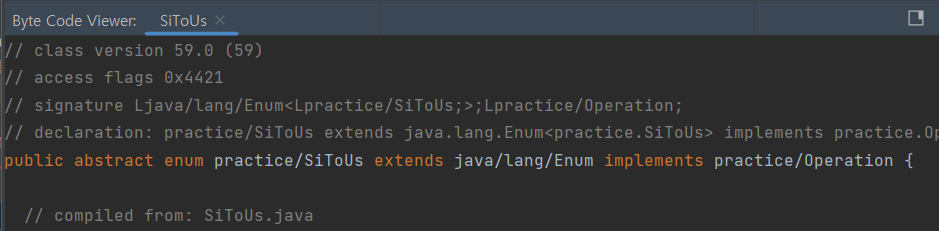
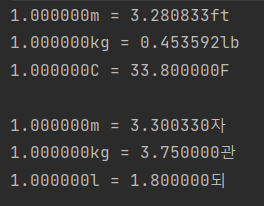
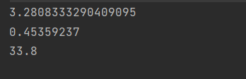

# 확장할 수 있는 열거 타입이 필요하면 인터페이스를 사용하라

<br>

## 📕 열거 타입(Enum)
### 열거 타입은 상속될 수 없다
  -  불변 클래스를 만드는 방법 중 '클래스를 확장할 수 없도록 한다'가 있다.
  -  Enum은 내부에서 해당 Enum이 가져야 하는 모든 인스턴스를 생성한 뒤 **private 생성자**를 선언해 추가적인 인스턴스가 생성되지 않도록 한다.
### 열거 타입은 상속할 수 없다
  - java에서 다중 상속은 불가능하다. 열거형을 컴파일할 때 java.lang.Enum 클래스를 상속하기 때문에 다른 클래스를 상속하는 것이 불가능하다.

<p align="center">

</p>

### 열거 타입을 확장하는 건 웬만해선 좋은 생각이 아니다
  - 자식 열거 타입에서는 부모 열거 타입과 자식 열거 타입이 같은 타입으로 취급되지만 부모 열거 타입에서는 서로 다른 열거타입으로 취급되는 것은 이상하다 
<br>

## 📕 Enum은 인터페이스를 통해 확장될 수 있다
  - 열거 타입이 확장되었을 때 어울리는 쓰임새로 **연산 코드(Operation Code)** 로 사용하는 방법이 있다.
  - 연산 코드의 각 원소는 특정 기계가 수행하는 연산을 뜻한다.
  - 보통 연산 코드용 인터페이스를 정의하고 열거 타입이 이 인터페이스를 구현하게 하면 된다.

```java
public interface Operation {
    double convert(double x);
    String siSymbol();
    String symbol();
}
```

```java
public enum SiToUs implements Operation {
    FOOT("m", "ft") {
        public double convert(double x) {
            return x / 0.30480061;
        }
    },
    POUND("kg", "lb") {
        public double convert(double x) {
            return x * 0.45359237;
        }
    },
    FAHRENHEIT("C", "F") {
        public double convert(double x) {
            return (x + 40) * 1.8 - 40;
        }
    };

    private final String siSymbol;
    private final String symbol;

    SiToUs(String SiSymbol, String symbol) {
        this.siSymbol = SiSymbol;
        this.symbol = symbol;
    }

    @Override
    public String siSymbol() {
        return siSymbol;
    }

    @Override
    public String symbol() {
        return symbol;
    }
}
```

```java
public enum SiToAncientAsia implements Operation {
    尺("m", "자") {
        public double convert(double x) {
            return x / 0.303;
        }
    },
    貫("kg", "관") {
        public double convert(double x) {
            return x * 3.75;
        }
    },
    升("l", "되") {
        public double convert(double x) {
            return x * 1.8;
        }
    };

    private final String siSymbol;
    private final String symbol;

    SiToAncientAsia(String siSymbol, String symbol) {
        this.siSymbol = siSymbol;
        this.symbol = symbol;
    }

    @Override
    public String siSymbol() {
        return siSymbol;
    }
    @Override
    public String symbol() {
        return symbol;
    }
}
```

<br>

```java
public class Main {
    public static void main(String[] args) {
        test(SiToUs.class, 1);
        test(SiToAncientAsia.class, 1);
    }
    
    private static <T extends Enum<T> & Operation> void test(Class<T> opEnumType, double x) {
        for (Operation op : opEnumType.getEnumConstants()) {
            System.out.printf("%f%s = %f%s\n", x, op.siSymbol(), op.convert(x), op.symbol());
        }
        System.out.println();
    }
}
```

<p align="center">
<br>
<em>Enum마다 서로 다른 연산 결과를 보여준다</em>
</p>


### 🤪 <T extends Enum<T> & Operation> 에 관하여 (참고)
  - 한정적 타입 토큰을 사용 (Enum은 일종의 클래스이다)
  - **T의 클래스 객체가 Enum타입**임과 동시에 **T가 Operation의 하위 타입**이어야 한다는 의미이다.

<br>

## 📕 코드 변경 없이 열거형 확장하기
  - 열거형을 변경할 수 없을 때는 어떻게 할 수 있을까?
  - 열거형 상수들을 키로 가지는 **EnumMap**을 활용하여 열거형 상수와 인터페이스의 필수 구현부를 연결할 수 있다.

```java
public interface Operation {
    double convert(double x);
}
```

```java
public enum ImmutableOperation {
    METER_TO_FOOT,
    KILOGRAM_TO_POUND,
    CELSIUS_TO_FAHRENHEIT
}
```

```java
public class Application {
    private static final Map<ImmutableOperation, Operation> OPERATION_MAP;

    static { // 람다식을 활용하여 Operatiopn을 구현
        OPERATION_MAP = new EnumMap<>(ImmutableOperation.class);
        OPERATION_MAP.put(ImmutableOperation.METER_TO_FOOT,
                x -> x / 0.30480061);
        OPERATION_MAP.put(ImmutableOperation.KILOGRAM_TO_POUND,
                x -> x * 0.45359237);
        OPERATION_MAP.put(ImmutableOperation.CELSIUS_TO_FAHRENHEIT,
                x -> (x + 40) * 1.8 - 40);
    }

    public static double applyImmutableOperation(ImmutableOperation operation, double x) {
        return OPERATION_MAP.get(operation).convert(x);
    }
}
```

```java
public static void main(String[] args) {
        System.out.println(Application.applyImmutableOperation(ImmutableOperation.METER_TO_FOOT, 1));
        System.out.println(Application.applyImmutableOperation(ImmutableOperation.KILOGRAM_TO_POUND, 1));
        System.out.println(Application.applyImmutableOperation(ImmutableOperation.CELSIUS_TO_FAHRENHEIT, 1));
}
```

<p align="center">
<br>
<em>위의 예시와 같은 연산 결과를 보여준다</em>
</p>

<br>

### 참고 자료
1. 이펙티브 자바 - item 38
2. https://www.infoworld.com/article/3543350/how-to-use-typesafe-enums-in-java.html
3. https://blog.hexabrain.net/393
4. https://www.baeldung.com/java-extending-enums
