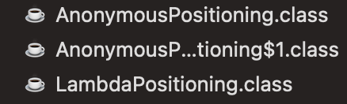

# 아이템 42. 익명 클래스보다는 람다를 사용하라

자바에서는 객체지향 언어다. 함수를 표현할 수 있는 타입이 따로 존재하지 않는다.

그래서 함수 타입을 표현하기 위해 `함수형 인터페이스` 를 사용한다.

### @FuntionalInterface

- 자바 8에서 부터 `추상 메소드`를 딱 `하나만` 갖고 있는 인터페이스를 함수형 인터페이스라고 부르기 시작했다.

```java
@FunctionalInterface
public interface ValueGenerator<T> {
	
	T generate(int min, int max);
	
	static void doSomething1() {
		//...
	}

	default void doSomething2() {
		//...
	}

}
```

- 함수형 인터페이스를 인스턴스화 해서 사용하기 위해서는  `T generate(int min, int max)` 와 같은 메소드를 정의해야 한다.
- 해당 인터페이스를 구현한 클래스를 직접 구현할 수도 있겠다.

```java
public class IntegerValueGenerator implements ValueGenerator<Integer> {
	
	Random random = new Random();

	@Override
	public Integer generate(int min, int max) {
		return random.nextInt(max - min + 1) + min ;
	}

}

public class Main {
	public static void main(String[] args) {
		ValueGenerator<Integer> valueGenerator = new IntegerValueGenerator();
	}
}
```

- 해당 구현체를 여러 군데에서 재사용을 한다면, 위와 같이 직접 클래스를 구현하는 것도 좋겠지만
- 한번만 사용하는 객체라면 그 부분에서 익명클래스로 사용하는 것도 괜찮을 것이다.

### 익명 클래스

- `선언`과 `사용`을 동시에 하는 클래스
- 이름이 없는 클래스이다. 이름이 없다는 것은 재사용이 되지 않는다는 것을 의미한다.
- 아래와 같이 valueGenerator 인터페이스를 파라미터로 받는 경우를 가정해보자.

```java
public class Line {
	
	private List<Bar> bars;

	private Line() {}

	public static Line create(int size, ValueGenerator<Integer> valueGenerator) {
		
		Line line = new Line();		
	
		line.bars = new ArrayList<>();
		
		for (int indexBars = 0; indexBars < size; indexBars++) {
			Bar bar = Bar.create(valueGenerator.generate(1, 2));
			line.bars.add(bar);
		}
		
		return line;
	}
 
}
```

- 다음과 같이 해당 메소드를 호출하는 부분에서 인터페이스를 정의하여 사용한다.

```java
Line line = Line.create(size, new ValueGenerator<Integer>() {
	Random random = new Random();

	public Integer generate(int min, int max) {
		return random.nextInt(max - min + 1) + min ;
	}

});
```

- 단점
    - 코드 길이가 너무 길다.
    - 클래스를 만들지 않으므로 재사용이 불가능하고, 관리가 힘들다.
- 예를 들어, 사다리의 방향을 나타내는 enum Direction에 다음 위치를 알려주는 기능을 생각해보자.

```java
public enum Direction {
	
	TURN_LEFT {
		public int followDirection(int currPosition) {
				return currPosition - 1;
		}
	},
	TURN_RIGHT {
		public int followDirection(int currPosition) {
				return currPosition + 1;
		}
	},
	GO_STRAIGHT {
		public int followDirection(int currPosition) {
				return currPosition;
		}
	};
	
	public abstract int followDirection(int currPosition);

} 
```

- 위와 같이 각 enum 마다 클래스의 몸체를 구현하여, 추상 메소드를 재정의를 하는 과정을 떠올려 보면 만약 여기서 함수형 인터페이스가 enum의 필드로 있다면 어떨까?

```java
public enum Direction {
	
	TURN_LEFT(new Positioning() {
		public int followDirection(int currPosition) {
				return currPosition - 1;
		}
	}),
	TURN_RIGHT(new Positioning() {
		public int followDirection(int currPosition) {
				return currPosition + 1;
		}
	}),
	GO_STRAIGHT(new Positioning() {
		public int followDirection(int currPosition) {
				return currPosition;
		}
	});
	
	private final Positioning positioning;

	Direction(Positioning positioning) {
		this.positioning = positioning;	
	}

} 

// --------------

@FunctionalInterface
public interface Positioning {

	int followDirection(int currPosition);

}
```

- 여전히 함수형 인터페이스, 즉, 1개의 추상 메소드를 재정의 하기 위해서 클래스를 구현하는 것은 번거로울 수 있다.
- 이를 대체할 수 있는 것이 `람다식`이다.

### 람다식

- 람다식(람다 표현식)이란, 하나의 추상 메소드를 식으로 정의한 것을 말한다.
- 이도 익명 클래스와 마찬가지로 해당 정의한 메소드를 재사용하지 않는 특징이 있다.
    - 따라서 이는 익명 함수다.
    - 클래스에 종속적인 것을 메소드라고 부르나, 람다식은 종속적이지 않으므로 함수라고 부를 수 있다.
    - 일급 객체로서 `매개변수`, `반환값` 일 수 있다.

```java
([타입] 파라미터1, [타입] 파라미터2,  ...) -> { 실행 내용 }
```

- 람다식의 구조
    - 좌항에는 파라미터
    - 우항에는 함수의 몸체
    - 그 사이에는 → 를 사용하여 표현한다.

```java
@FunctionalInterface
public interface Calculator {
	int calculate(int x, int y);
}
```

- 위와 같은 함수형 인터페이스가 있다고 할 때 다음과 같이 표현할 수 있다.

```java
//기본
(int x, int y) -> {
	System.out.println("람다식 호출");
	return x + y;
}
```

- 아래와 같이 변형 또한 가능하다.

```java
//타입 생략 가능
(x, y) -> {return x + y;}

//실행부 문장이 1줄일 때 중괄호{}와 return을 생략 가능하다
(x, y) -> x + y

//매개변수 1개일 경우 소괄호() 생략 가능
x -> x + 1;
```

### 타입 추론

- 위의 람다식에서 의아한 부분은 `매개변수의 타입` 이나 `리턴 타입` 을 입력하지 않아도 된다는 것이다.
- 타입 추론은 컴파일러가 코드의 문맥을 파악하여, 타입을 추론하는 것을 말한다,

```java
@FunctionalInterface
public interface Comparator<T> {
    int compare(T o1, T o2);
}
```

```java
Comparator<Integer> comparator = (x, y) -> x - y; 
```

- 위에 경우에도 제네릭으로 타겟 타입을 Integer로 선언해두었기 때문에, 매개변수 타입도 Integer로 추론을 할 수 있는 것이다.
- 대부분 파라미터 타입을 문맥적으로 파악할 수 있기 때문에 파라미터 타입을 생략하는 것은 대부분 가능하다.
- 하지만, 컴파일러가 파라미터 타입을 확인하지 못한다면, 타입을 명시해줘야한다.

### 적용

```java
public enum Direction {
	
	TURN_LEFT(position -> position - 1),
	TURN_RIGHT(position -> position + 1),
	GO_STRAIGHT(position -> position);
	
	private final Positioning positioning;

	Direction(Positioning positioning) {
		this.positioning = positioning;	
	}

} 

// --------------

@FunctionalInterface
public interface Positioning {

	int followDirection(int currPosition);

}
```

- 매우 간결해진 것을 볼 수 있다.
- 익명클래스를 구현하여 재정의하거나, 각 enum의 클래스 몸체를 구현하여 기능을 추가하여 재정의한 것 보다 짧은 코드로 의도를 잘 전달할 수 있다.

```java
Postioning leftPositioning = position -> position - 1;
```

### 람다의 한계

1. 람다를 사용하면 익명 함수이므로 재사용이 불가능하고 실제 구현 클래스가 없으므로 문서화를 하지 못한다.
2. 그리고 코드가 길어지면, 그 자체로 이해하는 것이 힘들어질 수 있다. 이렇게 되면 람다식을 사용하는 장점이 많이 사라지게 된다. 
3. 해당 인스턴스 자체(this), 필드, 메소드를 사용이 불가능하다.

### 람다에서 this / 익명클래스에서 this

```java
TURN_LEFT(new Positioning {
		public int followDirection(int currPosition) {
				System.out.println(this);
				return currPosition - 1;
		}
})
```

- 익명 클래스 내부에서 this란 익명 클래스인 인스턴스 자체를 지칭한다.

```java
TURN_LEFT(position -> {
	System.out.println(this);
	return position - 1
})
```

- 람다 식 내부에서 this는 Positioning이라는 함수형 인터페이스의 인스턴스가 아닌, TURN_LEFT enum을 가르키는 this가 된다.
- 람다의 경우 자기 자신의 객체 참조가 불가능하다. 그래서 자기 자신에 대한 참조가 필요하다면 익명 클래스를 쓰는 것이 좋겠다.

### 익명 클래스와 람다의 차이

- 익명클래스

```java
public class AnonymousPositioning {

    public static void main(String[] args) {
        Positioning leftPositioning = new Positioning() {
            @Override
            public int followDirection(int currPosition) {
                return currPosition + 1;
            }
        };

        System.out.println(leftPositioning);
    }

}
```

- 익명 클래스 사용은 컴파일 시, $숫자를 붙인 클래스를 만들어 사용한다.



- 람다식

```java
public class LambdaPositioning {

    public static void main(String[] args) {

        Positioning leftPositioning = x -> x + 1;

        System.out.println(leftPositioning);
        
    }

}
```


- 람다의 경우는 컴파일 시 클래스를 생성하지 않는다.
- `invokedynamic` 은 런타임에 동적으로 클래스를 정의하고 인스턴스를 생성해서 반환하는 명세이다.

### 정리

익명 클래스의 경우 함수형 타입 자체를 정의하려고 사용하기 보단, 반복적으로 필요하지 않은 클래스를 인스턴스화할 때 사용하면 될 것이다.

또한, 람다식으로 표현하는데, 실행부가 너무 길어 복잡하거나 자기자신의 인스턴스를 참조해야될 일이 있다면 람다식 보다는 익명 클래스를 고려해보는 것이 좋겠다.

하지만, 함수 자체를 매개변수나 리턴 값으로 사용하기 위해서 표현해야된다면, 람다식을 사용하여 자바에서 폭넓은 함수형 프로그래밍을 할 수 있도록 한다.