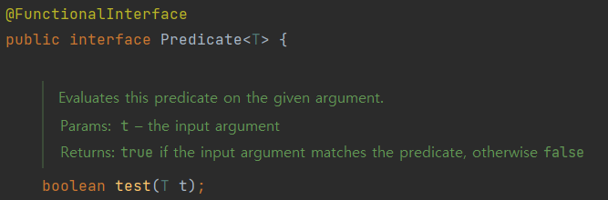
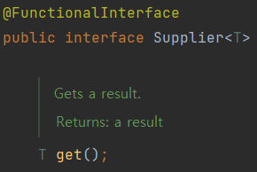
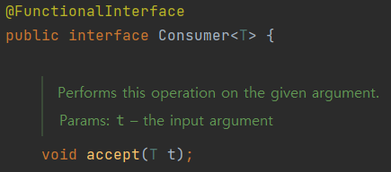
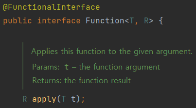
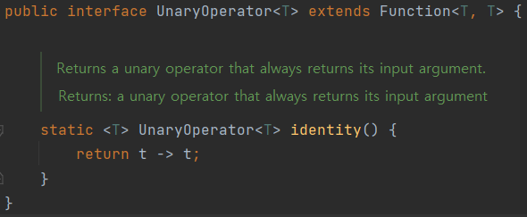
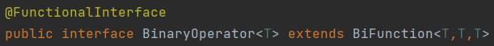

## 표준 함수형 인터페이스를 사용하라

### 함수형 인터페이스란?
- 추상 메서드를 한 개만 갖는 인터페이스
- Java 8부터 인터페이스는 디폴트 메서드를 포함할 수 있기 때문에 함수형 인터페이스가 여러 개의 디폴트 메서드와 스태틱 메서드를 가지는 건 상관없다.

#### 함수형 인터페이스 만들기
```java
@FunctionalInterface
interface RevenueCalculator {
    int calculateRevenue(int money);
}
```

<br>

### 기본 함수형 인터페이스
- 필요한 용도에 맞는 게 있다면, 직접 구현하지 말고 표준 함수형 인터페이스를 활용하자.
- `java.util.function` 패키지에는 총 43개의 인터페이스가 담겨 있지만 기본 인터페이스 6개만 기억하면 나머지를 유추해낼 수 있다.

|       인터페이스        |       함수 시그니처       |
|:------------------:|:-------------------:|
| UnaryOperator<T\>  |    T apply(T t)     |
| BinaryOperator<T\> | T apply(T t1, T t2) |
|   Predicate<T\>    |  boolean test(T t)  |
|  Function<T, R\>   |    R apply(T t)     |
|    Supplier<T\>    |       T get()       |
|    Consumer<T\>    |  void accept(T t)   |

- 퀴즈 : 위의 `RevenueCalculator`는 어느 인터페이스로 대체할 수 있을까?

<br>

#### Predicate<T>
- T 타입의 파라미터를 받아 함수를 실행해 boolean을 반환한다.
<p align="center">

</p>

#### Supplier<T>
- 함수를 실행해 T 타입의 출력을 반환한다.
<p align="center">

</p>

#### Consumer<T>
- T 타입의 파라미터를 받아 함수를 실행한다.
<p align="center">

</p>

#### Function<T, R>
- T 타입의 파라미터를 받아 함수를 실행해 R 타입의 출력을 반환한다.
<p align="center">

</p>

#### UnaryOperator<T>
- T 타입의 파라미터를 받아 함수를 실행해 T 타입의 출력을 반환한다.
<p align="center">

</p>

#### BinaryOperator<T>
- T 타입의 파라미터를 2개 받아 함수를 실행해 T 타입의 출력을 반환한다.
<p align="center">

</p>

<br>

### 기본형 특화 인터페이스
- 오토박싱으로 인한 비용을 절약하기 위해, 기본 타입용(int, long, double)으로 각각 3개씩 변형이 존재한다.
- 네이밍은 기본 인터페이스 이름 앞에 해당 기본 타입 이름을 붙인다.
- IntPredicate, LongBinaryOperator, DoubleSupplier...
- 단, Function의 변형은 파라미터만 기본타입용으로 제공하는 경우와 반환값을 기본타입용으로 제공하는 경우, 파라미터와 반환값 모두 기본타입용을 제공하는 경우가 존재한다.
- ex. IntFunction<R\>, ToIntFunction<T\>, DoubleToIntFunction

### 인수를 2개씩 받는 변형 인터페이스 (Bi- )
- BiPredicate<T, U>, BiFunction<T, U, R>, BiConsumer<T, U> 등이 존재한다.
- Consumer 인터페이스도 기본 타입 하나, 참조 타입 하나씩을 받는 변형이 존재한다.

<br>

### 전용 함수형 인터페이스를 구현해야 하는 경우
- 대부분 상황에서는 직접 작성하는 것보다 표준 함수형 인터페이스를 사용하는 편이 낫다
- 다만 표준 인터페이스에 맞는 게 없거나 다음의 특성을 만족한다면 새로 함수형 인터페이스를 정의해주어야 할지를 고민해보아야 한다.
> 1. 자주 쓰이며, 이름 자체가 용도를 명확히 설명해준다.
> 2. 반드시 따라야 하는 규약이 있다.
> 3. 유용한 디폴트 메서드를 제공할 수 있다.

<br>

#### 예시 : Comparator
```java
@FunctionalInterface
public interface Comparator<T> {
    int compare(T o1, T o2);
}
```

- `Comparator`는 구조적으로 ToIntBiFunction<T, U>와 동일하지만 위의 세 가지 특성을 모두 만족하기에 기본형 인터페이스와 형식이 완전히 동일하더라도 재정의해주어야 할 필요성이 있다.