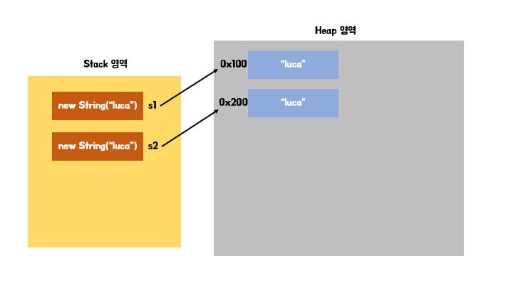
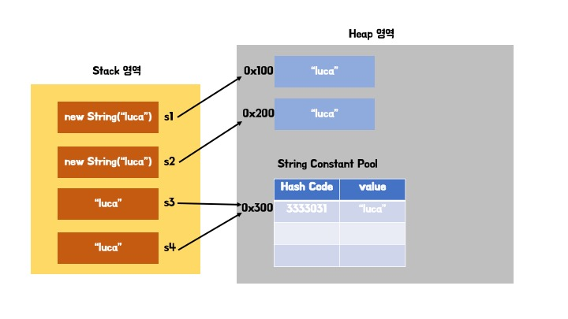
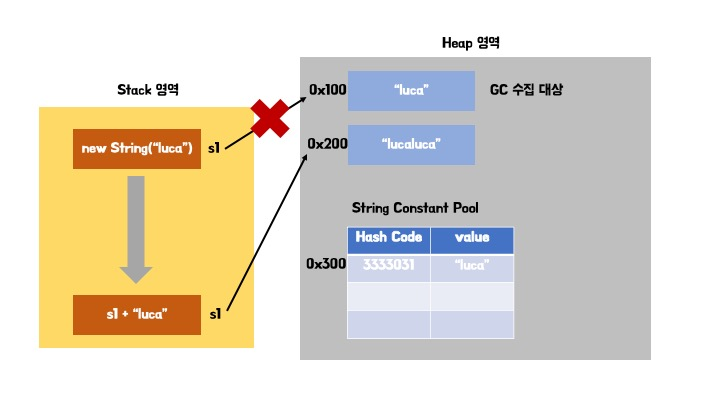
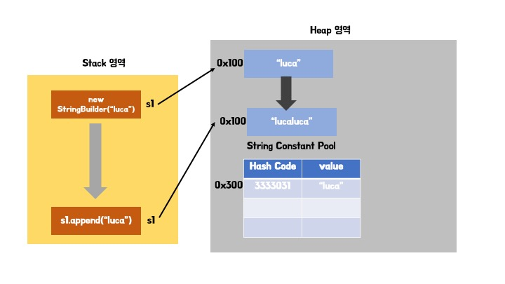
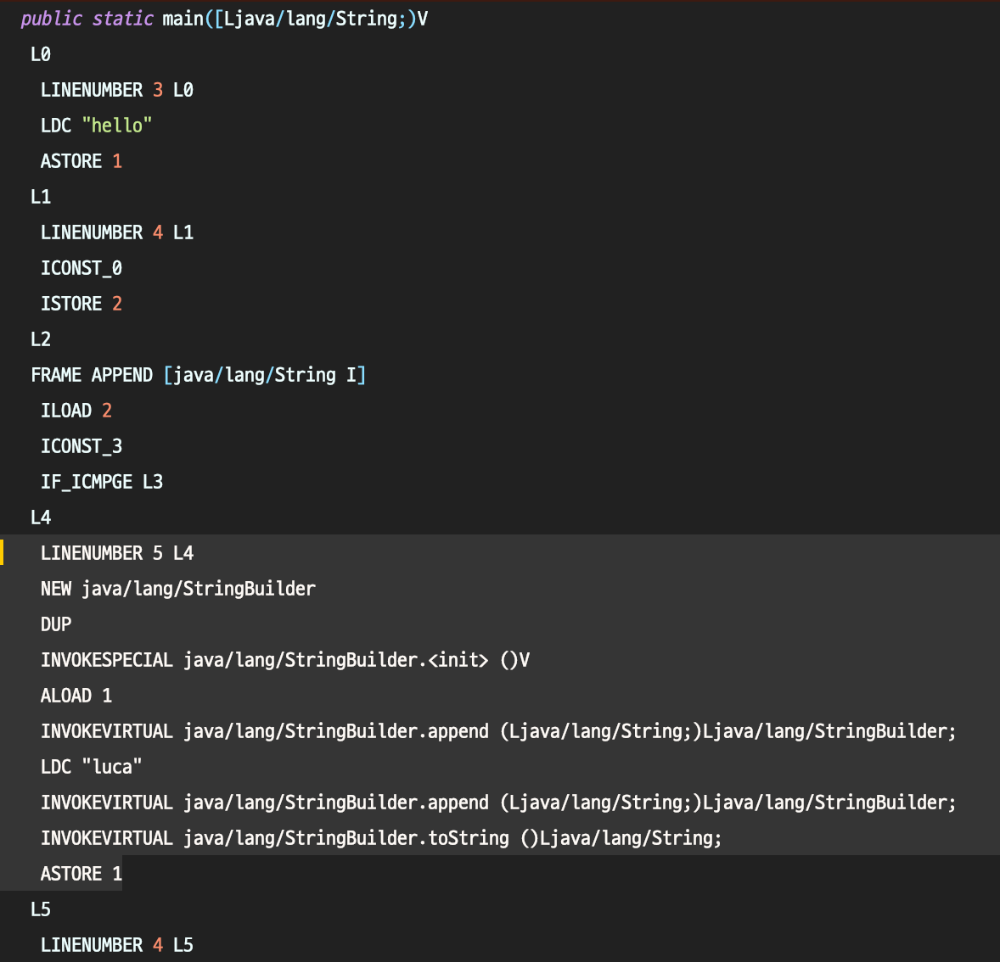
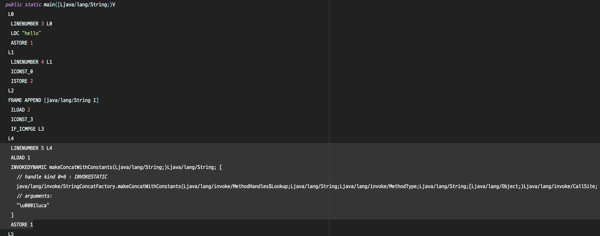

# item 63 문자열 연결은 느리니 주의하라
## 목적
* 문자열 연결에 대해 설명한다.
* 그 전에, String 클래스에 대해 살펴본다.

# java.lang.String

```java
public final class String implements java.io.Serializable, Comparable<String>, CharSequence {
    
    @Stable
    private final byte[] value;
    
    private final byte coder;
    
    private int hash;
    
    // ...
}
```

* 문자 배열(문자열)을 저장하는 객체
* 과거에는 char[]을 필드로 가졌지만, 현재(자바 9 부터)는 byte[]를 필드로 갖는다.
* 불변 객체(Immutable object)이다.
* corder 필드는 byte[] value를 인코딩할 때 사용되는 변수
  * LATIN1 (1바이트)
  * UTF-16 (기본값2바이트)


## 생성
### 생성자

* String 역시 객체이므로 new 연산자로 생성하는 방법이 있다.

```java
String() {}

String(byte[] bytes) {}

String(byte[] bytes, Charset charset) {}

String(byte[] bytes, int offset, int length) {}

String(byte[] bytes, int offset, int length, Charset charset) {}

String(byte[] bytes, int offset, int length, String charsetName) {}

String(byte[] bytes, String charsetName) {}

String(char[] value) {}

String(char[] value, int offset, int count) {}

String(int[] codePoints, int offset, int count) {}

String(String original) {}

String(StringBuffer buffer) {}

String(StringBuilder builder) {}
```

```java
String s1 = new String("luca");
String s2 = new String("luca");
```
* new 연산자로 생성한 객체는 힙영역에 올라가게 된다.


> **힙역영**  
> 모든 쓰레드가 공유하며, new 키워드로 생성된 객체와 배열이 생성되는 영역입니다. 또한, 메소드 영역에 로드된 클래스만 생성이 가능하고 Garbage Collector가 참조되지 않는 메모리를 확인하고 제거하는 영역입니다

### String 리터럴

* 리터럴이란?
  * 직접 `값`울 표현한 것

```java
String s3 = "hello";
String s4 = "hello";
```



* 리털럴로 생성한 String은 `String Constant Pool`에 올라간다.
### String Constant Pool
  * 힙영역에 존재하는 스트링을 저장해두는 공간
  * `ConcurrentHashMap`로 구현
  * 문자열의 hash code를 통해서 이미 스트링 풀에 있는 지 확인

### intern()
* String을 리털럴로 선언 시 intern() 메서드를 호출, 
* String Pool에 문자열을 해쉬를 통해서 찾고 
  * 있으면, 그 풀에 있는 String의 주소 값을 참조함
  * 없으면, 새로운 String을 만들어 String Pool에 추가

```java
String s1 = new String("luca");
String s2 = new String("luca");
String s3 = "luca";
String s4 = "luca";

System.out.println(s1 == s2); //false
System.out.println(s2 == s3); //false
System.out.println(s3 == s4); //true
System.out.println(s4 == s1); // false
```
* intern() 메서드를 호출하면 스프링 풀에서 찾게된다.

```java
String s1 = new String("luca");
String s3 = "luca";

s1 = s1.intern();

System.out.println(s1 == s3); //true
```
# \+ 연산과 최적화
* String은 불변이다.
* String 자료형 내에서 문자열을 합치는 방법은 2가지가 있다.
  * \+ 연산자
  * concat() 메서드

```java
String s1 = new String("luca");
s1 = s1 + "luca";
```



* 매번 \+ 연산을 진행할 때마다 새로운 객체를 생성하기 때문에 비효율적이다.

* String은 기본적으로 불변이기 때문에 `concat()`, `toUpperCase()`, `trim()`같은 메서드를 사용할 때도 내부의 필드가 바뀌는 것이 아니라 새로운 String 객체를 생성해서 반환한다.


## StringBuilder
* StringBuilder는 문자열을 다룬다.
* String과는 다르게 가변적이다.
  * 버퍼라는 데이터를 임시로 저장하는 공간에 메모리를 저장해두고
  * 버퍼의 공간이 모자르다면 가변적으로 공간을 늘리는 형식으로 작동한다.

```java
public final class StringBuilder extends AbstractStringBuilder
    implements java.io.Serializable, Comparable<StringBuilder>, CharSequence {

  public StringBuilder() {
    super(16);
  }
  
  public StringBuilder(String str) {
    super(str.length() + 16);
    append(str);
  }

  public StringBuilder append(String str) {
    super.append(str);
    return this;
  }
}
```
```java
abstract class AbstractStringBuilder implements Appendable, CharSequence {

  byte[] value;

  byte coder;

  int count;

  private static final byte[] EMPTYVALUE = new byte[0];

  AbstractStringBuilder() {
    value = EMPTYVALUE;
  }

  AbstractStringBuilder(int capacity) {
    if (COMPACT_STRINGS) {
      value = new byte[capacity];
      coder = LATIN1;
    } else {
      value = StringUTF16.newBytesFor(capacity);
      coder = UTF16;
    }
  }

  public AbstractStringBuilder append(String str) {
    if (str == null) {
      return appendNull();
    }
    int len = str.length();
    ensureCapacityInternal(count + len);
    putStringAt(count, str);
    count += len;
    return this;
  }
  
}
```
* 기본 용량은 16이다.
* char[]로 관리한다.
* apped(String s) 시 길이가 부족하다면 필요한 배열의 크기로 복사하여 사용한다.
* 이때 새로운 char[]를 생성할 때 기존 용량에 2배를 지정하여 문자열 추가를 효율적으로 문자열 추가를 한다.

```java
StringBuilder sb = new StringBuilder("luca");

sb.append("luca");
```


* 반복적으로 문자열을 이어 붙일 때는 StringBuilder를 사용하는 것이 적절하다.

## 최적화

> 진짜로 + 연산자가 느릴까?

```java
String s = "hello";
for(int i = 0; i < 3; i++) {
    s += "luca";    
}
```

### ~ JDK 8 / StringBuilder

* String을 \+ 연산자로 연결 작업을 하면,
  * StringBuilder 객체를 생성하고
  * append()를 하는 방식으로 최적화를 해준다.
* 하지만 이는, 한번의 연결 작업에서는 괜찮지만
* 위와 같은 반복문에서는 매번 StringBuilder를 생성하게 된다.

### JDK 9 ~ / StringConcatFactory


```java
public final class StringConcatFactory {
  private enum Strategy {
    /**
     * Bytecode generator, calling into {@link java.lang.StringBuilder}.
     */
    BC_SB,

    /**
     * Bytecode generator, calling into {@link java.lang.StringBuilder};
     * but trying to estimate the required storage.
     */
    BC_SB_SIZED,

    /**
     * Bytecode generator, calling into {@link java.lang.StringBuilder};
     * but computing the required storage exactly.
     */
    BC_SB_SIZED_EXACT,

    /**
     * MethodHandle-based generator, that in the end calls into {@link java.lang.StringBuilder}.
     * This strategy also tries to estimate the required storage.
     */
    MH_SB_SIZED,

    /**
     * MethodHandle-based generator, that in the end calls into {@link java.lang.StringBuilder}.
     * This strategy also estimate the required storage exactly.
     */
    MH_SB_SIZED_EXACT,

    /**
     * MethodHandle-based generator, that constructs its own byte[] array from
     * the arguments. It computes the required storage exactly.
     */
    MH_INLINE_SIZED_EXACT
  }

  public static CallSite makeConcatWithConstants(MethodHandles.Lookup lookup,
                                                 String name,
                                                 MethodType concatType,
                                                 String recipe,
                                                 Object... constants) throws StringConcatException {
    if (DEBUG) {
      System.out.println("StringConcatFactory " + STRATEGY + " is here for " + concatType + ", {" + recipe + "}, " + Arrays.toString(constants));
    }

    return doStringConcat(lookup, name, concatType, false, recipe, constants);
  }
}
```
* 기본전략은 `MH_INLINE_SIZE_EXACT` 이 사용되기 되는데, 
* 이 전략은 문자열 연결 작업이 특정 크기 이하일 경우, 
  * 다른 메서드를 호출하는 것이아니라 인라인 코드로 처리하여 성능을 향상시킵니다.
* 문자열 연결 작업의 크기를 예측할 경우에 적합하다.

* 나머지 전략에서 대부분 StingBuilder를 사용한다.
  * 매 연결마다 StringBuilder를 생성하지 않고,
  * 미리 만들어 둔 StringBuilder를 통하여, 문자열 연결을 한다.

# 결론 
* `+ 연산자`를 사용하면 버전에 따라서 `최적화`가 진행된다.
  * jdk 8 까지는 매 반복문 마다 `StringBuilder` 객체를 생성하는 방식으로 진행되어 성능의 저하가 심하다.
  * jdk 9 이후에는 `StringConcatFactory`를 사용하여 개선되었다.
* 하지만, 자바 버전에 의존하는 코딩보다
  * 애초에 StringBuilder 사용하여 문자열 연결을 하는 것은 어떨까. 

```java
StringBuilder sb = newStringBuilder("hello");
for(int i = 0; i < 3; i++) {
    sb.append("luca");    
}
String s = sb.toString();
```
