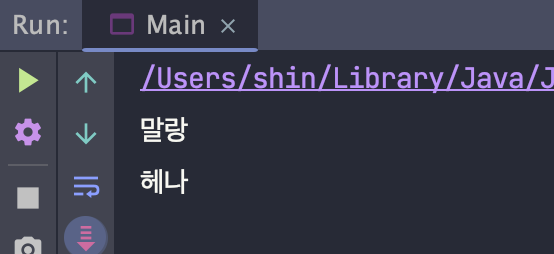
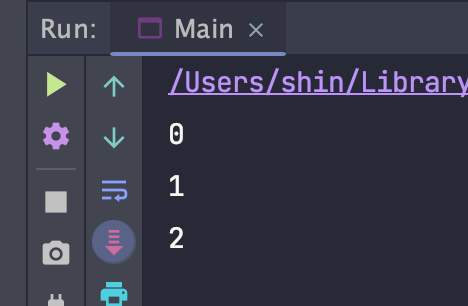
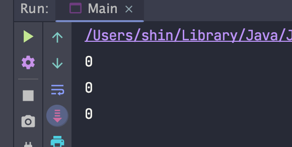
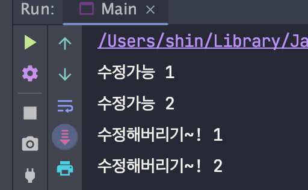
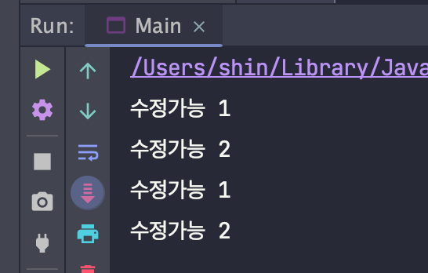
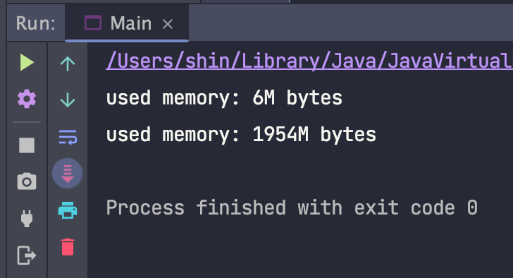
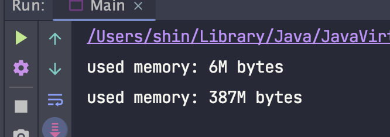
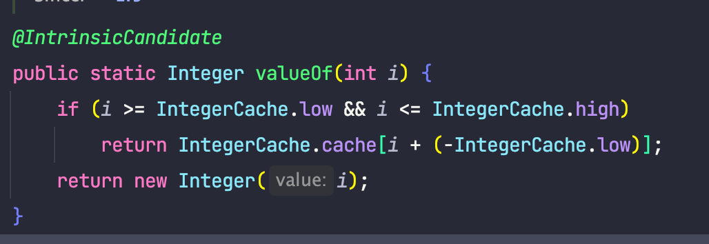
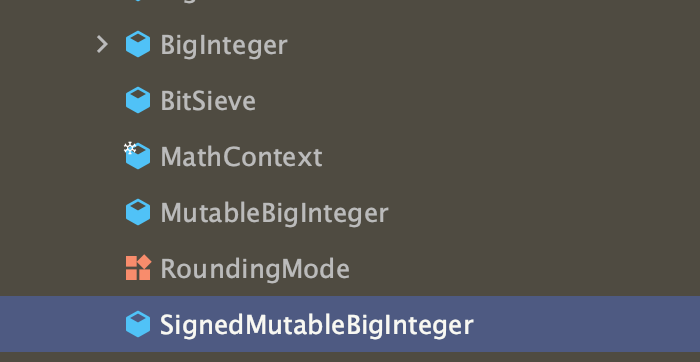
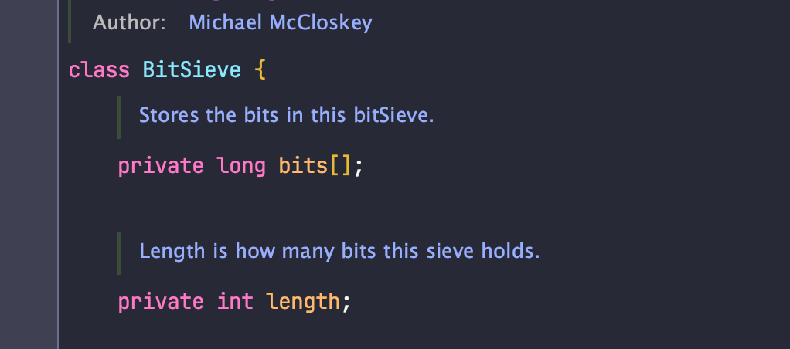

## 🧐 불변 클래스?

불변 클래스란 해당 **인스턴스 내부의 값을 수정할 수 없도록** 구현된 클래스입니다.

불변 인스턴스에 설정된 정보는 객체 생성 시점에 고정되어, 해당 객체가 제거되는 순간까지 절대 달라지지 않습니다.

흔히 사용하는 불변 클래스로는 private 타입을 박싱한 클래스들(Integer, Double 등)과 String, BigInteger, BigDemical 등이 있습니다.

불변 클래스는 가변 클래스보다 오류가 생길 여지도 적고, 훨씬 안전하게 사용할 수 있습니다.

<br><br><br>

## 🧐 불변 클래스는 어떻게 만들지?

다음과 같은 규칙들을 통해 불변 클래스를 만들 수 있습니다.

- 객체의 **상태를 변경하는 메서드**(setter 등)를 제공하지 않습니다.
- 클래스를 **확장**할 수 없도록 합니다.
- 모든 필드를 **final**로 선언합니다.
- 모든 필드를 **private**로 선언합니다.
- 자신 외에는 내부의 **가변 컴포넌트**에 접근할 수 없도록 합니다.

<br><br><br>

## 🧐 객체의 상태를 변경하는 메서드를 제공하지 않는다

만약 객체의 상태를 변경하는 메서드를 제공한다면 어떻게 될까요?

상태를 변경한다는 것 자체로부터 불변에는 어긋나지만, 그래도 살펴보도록 하겠습니다.

예시를 위해 다음과 같은 Person 클래스를 작성했습니다.

```
public class Person {

    private String name;

    public Person(final String name) {
        this.name = name;
    }

    public String name() {
        return name;
    }
    
    /* 변경자 */
    public void setName(final String name) {
        this.name = name;
    }
}
```

해당 클래스에서는 setName()이라는 메서드를 통해, 해당 객체의 상태를 변경할 수 있도록 제공합니다.

실제 값이 달라지는 예시는 아래와 같습니다.

```
public class Main {

    public static void main(String[] args) {
        Person 말랑 = new Person("말랑");
        System.out.println(말랑.name());
        말랑.setName("헤나");
        System.out.println(말랑.name());
    }
}
```



위와 같이 객체의 상태를 변경하는 메서드를 제공하면, 클래스를 불변으로 만들 수 없습니다.

<br><br><br>

## 🧐 클래스를 확장할 수 없도록 한다

이는 하위 클래스에서 부주의하게, 혹은 나쁜 의도로 객체의 상태를 변하게 만드는 사태를 막아줍니다.

상속을 막는 대표적인 방법으로는 **클래스를 final**로 설정하는 방법과, 뒤에서 알아볼 **private(or default) 생성자 + 정적 팩터리 메서드**를 사용한 방법이 있습니다.

클래스를 상속받을 수 있다면 해당 클래스는 값이 변경될 수 있다는 것을 의미하는데, 어떻게 이것이 가능한지 위의 클래스를 계속해서 사용해서 살펴보겠습니다.

```
public class Person {

    private String name;

    public Person(final String name) {
        this.name = name;
    }

    public String name() {
        return name;
    }
}
```

이번에는 기존에 제공하던 setter를 제거함으로써, 객체의 상태를 변경하는 메서드를 제공하지 않도록 수정하였습니다.

이러면 값을 바꿀 수 없지 않을까요?

해당 클래스의 모든 필드가 private라면 내부의 값을 변경할 수 있는 방법은 없지만, 다음과 같이 값이 바뀐 것 처럼 사용이 가능합니다.

```
public class Man extends Person {
   
    private String name;
    
    public Man(final String name) {
        super(name);
        this.name = "나쁜이름" + name;
    }

    @Override
    public String name() {
        return "mam" + this.name;
    }
}
```

```
public class Main {

    public static void main(String[] args) {
        Person 말랑 = new Man("말랑");
        System.out.println(말랑.name());
    }
}
```


<br>
<br>

### 👉 상속을 막는 또다른 방법

class에 final을 사용함으로써 상속을 막을 수 있었는데요, 이보다 조금 더 유연한 방법을 통해 상속을 막는 방법에 대해서 알아보겠습니다.

모든 생성자를 private 혹은 package-private(default)로 만들 후, public 정적 팩터리 메서드를 제공하는 방법입니다.

```
public class Person {

    private String name;

    /* (private) */ 
    Person(final String name) {
        this.name = name;
    }
    
    public static Person nameOf(final String name) {
        return new Person(name);
    }

    public String name() {
        return name;
    }
}
```

위와 같이 사용하면 package외부에서는 사실상 final 클래스와 동일하게 동작할 뿐더러, 내부에서는 해당 클래스를 상속하여 여러 클래스를 생성할 수 있기 때문에 훨씬 유연한 방법입니다.

<br><br><br>

## 🧐 모든 필드를 final로 선언한다

자바 언어에서 final을 사용하면 값을 바꿀 수 없기 때문에, 명시적으로 값을 불변으로 만들 수 있습니다.

새로 생성된 인스턴스를 동기화 없이 다른 스레드에 전달하더라도 문제없이 동작하게끔 동작하는 데에도 필요합니다.

<br><br><br>

## 🧐 모든 필드를 private로 선언한다

필드가 참조하는 가변 객체를 클라이언트에서 직접 수정하지 못하도록 방지해줍니다.

public final로만 선언하더라도 불변 객체로 만들 수 있지만, 이렇게 된다면 이후 버전들에서 내부 필드명을 바꿀 수 없으므로 private로 선언하는 것을 권장합니다.

예시는 다음과 같습니다.

```
public class Person {

    public final String name;

    public Person(final String name) {
        this.name = name;
    }

    public String name() {
        return name;
    }
}
```

위와 같이 구현된 경우 아래와 같이 필드에 직접 접근할 수 있게 됩니다.

```
public class Main {

    public static void main(String[] args) {
        Person 말랑 = new Man("말랑");
        System.out.println(말랑.name);
    }
}
```

이 경우 Person의 name 필드를 nickname으로 변경하면 컴파일 오류가 발생하게 됩니다.

즉 모든 필드가 private가 아니어도 불변 클래스로 만들 수는 있지만, 위와 같은 상황이 발생할 수 있으므로 권하지 않습니다.

<br><br><br>

## 🧐 자신 외에는 내부의 가변 컴포넌트에 접근할 수 없도록 한다

클래스에 가변 객체를 참조하는 필드가 하나라도 있다면 클라이언트에서 그 객체의 참조를 얻을 수 없도록 해야 합니다.

이런 필드는 클라이언트가 제공한 객체 참조를 그대로 사용해서는 안되며, 접근자 메서드가 그 필드를 그대로 반환해서도 안됩니다.

이를 위해서는 생성자와 접근자 메서드에서 **방어적 복사**를 수행해야 합니다.

우선 방어적 복사를 사용하지 않은 코드의 문제점을 살펴보겠습니다.

```
public class CanModify {

    private String name;

    public CanModify(final String name) {
        this.name = name;
    }

    public String name() {
        return name;
    }

    public void setName(final String name) {
        this.name = name;
    }
}
```

```
import java.util.List;

public class Person {

    private final String name;
    private final List<CanModify> canModifies;

    public Person(final String name, final List<CanModify> canModifies) {
        this.name = name;
        this.canModifies = canModifies;
    }

    public String name() {
        return name;
    }

    public List<CanModify> canModifies() {
        return canModifies;
    }
}
```

위 클래스는 불변 클래스일까요?

<br>

다음 예시를 확인해 보도록 하겠습니다.

```
import java.util.ArrayList;
import java.util.List;

public class Main {

    public static void main(String[] args) {
        List<CanModify> modifies = new ArrayList<>();
        Person 말랑 = new Person("말랑", modifies);
        System.out.println(말랑.canModifies().size());  // 0

        modifies.add(new CanModify("추가"));
        System.out.println(말랑.canModifies().size());  // 1

        List<CanModify> canModifies = 말랑.canModifies();
        canModifies.add(new CanModify("추가"));
        System.out.println(말랑.canModifies().size());  // 2
    }
}
```

위 코드의 출력은 다음과 같습니다.



즉 Person 내부의 값이 바뀐 것을 알 수 있습니다.

이를 해결하기 위해서는 **방어적 복사**를 사용할 수 있는데요, 다음과 같습니다.

```
import java.util.ArrayList;
import java.util.List;

public class Person {

    private final String name;
    private final List<CanModify> canModifies;

    public Person(final String name, final List<CanModify> canModifies) {
        this.name = name;
        this.canModifies = new ArrayList<>(canModifies);
    }

    public String name() {
        return name;
    }

    public List<CanModify> canModifies() {
        return new ArrayList<>(canModifies);
    }
}
```

생성자를 통해 받아오는 값과, getter 등을 통해 객체가 가진 List를 반환하는 경우, 방어적 복사를 사용함으로써 외부의 값의 변화와 무관하게 객체 내부의 상태를 지킬 수 있게 됩니다.

<br>

위와 같이 수정한 후, 기존 main 코드를 실행시킨 결과는 다음과 같습니다.



그럼 이제 해당 Person 클래스는 불변 클래스일까요?

<br>

아직 하나 더 남았습니다.

다음 예시를 추가로 보도록 하겠습니다.

```
import java.util.List;

public class Main {

    public static void main(String[] args) {
        List<CanModify> modifies = List.of(new CanModify("수정가능 1"), new CanModify("수정가능 2"));
        Person 말랑 = new Person("말랑", modifies);

        System.out.println(말랑.canModifies().get(0).name());
        System.out.println(말랑.canModifies().get(1).name());

        modifies.get(0).setName("수정해버리기~! 1");
        말랑.canModifies().get(1).setName("수정해버리기~! 2");

        System.out.println(말랑.canModifies().get(0).name());
        System.out.println(말랑.canModifies().get(1).name());
    }
}
```

위 코드의 실행 결과는 다음과 같습니다.



즉 값이 변경된 것을 알 수 있는데요, 이는 List 자체를 변경하는 것은 불가능하지만, List 내부에 존재하는 객체들에 대한 참조는 공유될 수 있기 때문입니다.

즉 이를 막기 위해서는 **깊은 복사**를 사용해야 합니다.

깊은 복사를 구현하는 방법에는 여러가지가 있지만, 간단하게 복사 생성자를 통해 구현하도록 하겠습니다.

```
public class CanModify {

    private String name;

    public CanModify(final String name) {
        this.name = name;
    }

    public CanModify(final CanModify canModify) {
        this.name = canModify.name;
    }

    public String name() {
        return name;
    }

    public void setName(final String name) {
        this.name = name;
    }
}

```

Person 코드는 다음과 같이 변경됩니다.

```
import java.util.List;

public class Person {

    private final String name;
    private final List<CanModify> canModifies;

    public Person(final String name, final List<CanModify> canModifies) {
        this.name = name;
        this.canModifies = canModifies.stream()
                .map(CanModify::new)
                .toList();
    }

    public String name() {
        return name;
    }

    public List<CanModify> canModifies() {
      return canModifies.stream()
                .map(CanModify::new)
                .toList();
    }
}
```

위와 같이 새로운 객체들을 만들어 주는 것을 통해, 외부에서의 참조를 끊어버릴 수 있습니다.

기존 main 코드의 출력은 다음과 같아집니다.



<br>
<br>
<br>

## 🧐 불변 객체의 예시

책에서는 불변 복소수 클래스를 예시로 설명하였지만, 해당 예시는 이미 많은 자료가 있으므로 다른 예시를 사용하도록 하겠습니다.

```
import java.util.Objects;

public class Money {

    private final int amount;

    Money(final int amount) {
        this.amount = amount;
    }

    public static Money wons(final int amount) {
        return new Money(amount);
    }

    public int amount() {
        return amount;
    }

    public Money plus(final Money money) {
        return new Money(amount + money.amount);
    }

    public Money minus(final Money money) {
        return new Money(amount - money.amount);
    }

    public Money times(final Money money) {
        return new Money(amount * money.amount);
    }

    public boolean isLessThan(final Money money) {
        return this.amount < money.amount;
    }

    public boolean isGreaterThanOrEqual(final Money money) {
        return this.amount >= money.amount;
    }

    @Override
    public boolean equals(final Object o) {
        if (this == o) return true;
        if (!(o instanceof Money money)) return false;
        return amount == money.amount;
    }

    @Override
    public int hashCode() {
        return Objects.hash(amount);
    }
}
```

해당 클래스는 돈을 표현합니다.

돈을 더하고, 빼고, 곱하는 메서드와, 돈의 크기 비교 기능을 제공하며, equals와 hashCode를 구현함으로써 같은 양의 돈에 대해서는 동일하게 취급합니다.

이때 plus, minus 등의 메서드는 인스턴스 자신을 수정하는 것이 아니라 새로운 Money 인스턴스를 만들어서 반환합니다.

이처럼 피연산자에 함수를 적용해서 그 결과를 반환하지만, 피연산자 자체는 그대로인 프로그래밍 패턴을 **함수형 프로그래밍**이라고 합니다.

(같은 입력에 대해서는 항상 같은 결과가 출력됨)

이때 메서드 이름으로 add와 같은 동사 대신 plus같은 전치사를 사용한 점에도 주목하여야 하는데, 이는 해당 메서드가 객체의 값을 변화시키지 않는다는 것을 강조하려는 의도입니다.

위의 방식처럼 프로그래밍하면 코드에서 불변이 되는 영역의 비율이 높아지는 장점을 누릴 수 있습니다.

<br>
<br>
<br>

## 🧐 불변 객체의 장점

불변 객체는 단순합니다.

이들은 생성된 시점에서의 내부의 값이 절대 변하지 않기 때문에 **부작용(side-effect)**를 발생시키지 않으며 따라서 여러 객체에서 공유하여 사용할 수 있습니다.

또한 thread-safe 하기 때문에 멀티쓰레드 환경에서 따로 동기화하지 않고 사용할 수 있습니다.

객체를 만들 때 다른 불변 객체들을 구성요소로 사용하면 이점이 많습니다.

값이 바뀌지 않는 구성요소들로 이루어진 객체라면, 그 구조가 복잡하더라도 불변식을 유지하기 훨씬 수월하기 때문입니다.

하나의 예시로는 불변 객체는 Map의 Key와 집합의 원소로 쓰기에 좋습니다.

또한 불변 객체는 그 자체로**실패 원자성**을 제공합니다.(실패 원자성이란 메서드에서 예외가 발생한 후에도 그 객체는 여전이 메서드 호출 전과 동일한 상태여야 한다는 성질입니다.)

불변 객체는 공유가 가능하기 때문에, 자주 쓰이는 값들에 대해서는 계속 생성하여 사용하기보다는 미리 상수로 정의한 뒤 재사용할 수 있습니다.

다음과 같이 억지 예시를 하나 만들어 보겠습니다.

```
import java.util.List;
import java.util.stream.IntStream;

public class Main {

    public static void main(String[] args) {
        printUsedMemory();
        List<Money> monies = IntStream.range(0, 100_000_000)
                .mapToObj(it -> new Money(0))
                .toList();
        printUsedMemory();
    }

    private static void printUsedMemory() {
        final long totalMemory = Runtime.getRuntime().totalMemory() / 1024 / 1024;
        final long freeMemory = Runtime.getRuntime().freeMemory() / 1024 / 1024;
        final long usedMemory = totalMemory - freeMemory;
        System.out.println("used memory: " + usedMemory + "M bytes");
    }
}
```

위 결과는 다음과 같습니다.



즉 매번 새로운 객체를 만들어주기 때문에 많은 양의 메모리를 사용한 것을 알 수 있습니다.

<br>

이를 해결하기 위해 0원을 의미하는 상수를 정의한 뒤 사용하도록 하겠습니다.

```
import java.util.Objects;

public class Money {

    public static final Money ZERO = Money.wons(0);

    private final int amount;

    Money(final int amount) {
        this.amount = amount;
    }

    public static Money wons(final int amount) {
        return new Money(amount);
    }

	// 생략
}
```

```
import java.util.List;
import java.util.stream.IntStream;

public class Main {

    public static void main(String[] args) {
        printUsedMemory();
        List<Money> monies = IntStream.range(0, 100_000_000)
                .mapToObj(it -> Money.ZERO)
                .toList();
        printUsedMemory();
    }

    private static void printUsedMemory() {
        final long totalMemory = Runtime.getRuntime().totalMemory() / 1024 / 1024;
        final long freeMemory = Runtime.getRuntime().freeMemory() / 1024 / 1024;
        final long usedMemory = totalMemory - freeMemory;
        System.out.println("used memory: " + usedMemory + "M bytes");
    }
}
```

결과는 다음과 같습니다.



즉 자주 사용되는 값을 미리 정의한 뒤 공유함으로서, 메모리를 절약할 수 있습니다.

<br>
<br>
<br>

## 🧐 불변 객체에서 정적 팩터리 메서드 사용의 장점

위의 재활용 방식에서 조금만 더 들어가보면, 불변 클래스는 자주 사용되는 인스턴스를 **캐싱**하여 같은 인스턴스를 중복 생성하지 않게 해주는 정적 팩터리를 제공할 수 있습니다.

박싱된 기본 클래스 전부와 BigInteger가 여기여 해당됩니다.

하나의 예시로는 Integer의 valueOf 메서드가 있습니다.



이러한 정적 팩터리를 사용하명 여러 클라이언트가 인스턴스를 공유하여 메모리 사용량과 가비지 컬렉션 비용이 줄어듭니다.

새로운 클래스를 설계할 때 public 생성자 대신 **정적 팩터리**를 만들어둔다면, 클라이언트를 수정하지 않고도 필요에 따라 캐시 기능을 나중에 덧붙일 수 있습니다.

불변객체를 자유롭게 공유할 수 있다는 점은, 불변 객체에 대한 방어적 복사도 필요하지 않다는 것을 의미합니다.

아무리 복사하도 결국 원본과 똑같기 때문인데, 따라서 불변 클래스는 clone 메서드나 복사 생성자를 제공하지 않는 것이 좋습니다.

<br>
<br>
<br>

## 🧐 불변 객체의 단점

불변 객체는 값이 다르다면 반드시 독립된 객체로 만들어야 하기 때문에, 값의 가짓수가 많은 경우 이들을 모두 만드는 데 큰 비용을 지불해야 합니다.

예를 들어 수백만 비트짜리 BigInteger 객체에서, 비트 하나만을 바꿔야 한다고 하면, 원본과 단지 한 비트만이 다른 백만 비트짜리 인스턴스를 생성해야 합니다.

이러한 연산은 BigInteger가 커지면 커질수록 이에 비례하여 시간과 공간을 소모합니다.


<br>
<br>
<br>

## 🧐 가변 동반 클래스

원하는 객체를 완성하기까지 단계가 많고, 그 중간 단계에서 만들어진 객체들이 모두 버려진다면 성능 문제는 더 심해집니다.

이 문제에 대처하는 방법으로는 흔히 쓰일 다단계 연산(multistep operation)들을 예측하여 기본 기능으로 제공하는 방법입니다.

만약 이런 다단계 연산들을 기본 기능으로 제공한다면 더 이상 각 단계마다 객체를 생성하지 않아도 됩니다.

불변 객체는 내부적으로 아주 효율적으로 구현할 수 있기 때문인데, 예를 들어 BigInteger는 모듈러 지수와 같은 다단계 연산 속도를 높여주는 가변 동반 클래스를 package-private로 두고 있습니다.

BigInterger는 내부적으로 BitSieve, MutableBigInteger등의 가변 동반 클래스를 사용하여 성능을 높입니다.



이들은 다음과 같이 package-private로 정의되었기에 외부에서는 사용할 수 없고, BigInteger 내부적으로 사용됩니다.



클라이언트가 원하는 복잡한 연산들을 정확하게 예측할 수 있다면 package-private 의 가변 동반 클래스만으로 충분하지만, 그렇지 않는 경우 이러한 가변 동반 클래스를 public으로 제공하는게 최선의
방법입니다.

이러한 대표적인 예시로는 String과 그의 가변 동반 클래스인 StringBuilder 입니다.

<br>
<br>
<br>

## 🧐 불변 객체 정리하기

초반 불변 객체의 설계 방법에서 "모든 필드가 final"이고 어떤 메서드도 그 객체를 수정할 수 없어야 합니다.

사실 해당 규칙은 조금 과한 부분이 있으므로, 성능을 위해 다음과 같이 완화할 수 있습니다.

> 어떤 메서드도 객체의 상태 충 외부에 비치는 값을 변경할 수 없다

실제로 어떤 불변 클래스는 계산 비용이 큰 값을, 최초 사용 시 계산한 뒤, final이 아닌 필드에 캐시해놓기도 합니다.

정리하면 다음과 같습니다.

- getter가 있다고 무조건 setter를 생성하는 것은 좋지 않습니다.
- 클래스는 꼭 필요한 경우가 아니라면 불변인 것이 좋습니다.
- 블변으로 만들 수 없는 클래스라도 변경할 수 있는 부분은 최소한으로 줄이는 것이 좋습니다.
- 생성자는 불변식 설정이 모두 완료된 초기화가 완벽히 끝난 상태의 객체를 생성해야 합니다.

<br>
<br>
<br>